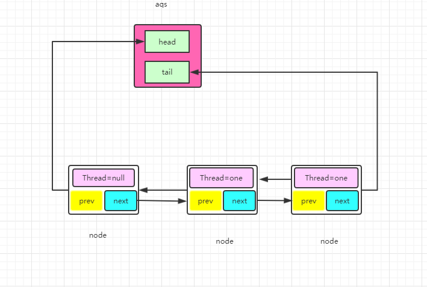

## AQS源码

### 成员

AQS有Node类型的head和tail，用来记录等待队列的头和尾

volatile int state是锁状态，加锁成功则为1，重入+1 解锁则为0

AQS的核心思想就是申请锁的线程CAS改变state

失败后的线程需要加入到队列的尾部，一旦锁被释放了，AQS就把锁让给队首的第二个node

当然在此基础上有公平锁/非公平锁、排他锁（Reentrantlock）/共享锁（CountDownLatch/Semaphore）多种实现

<!--more-->

```java
/**
 * Head of the wait queue, lazily initialized.  Except for
 * initialization, it is modified only via method setHead.  Note:
 * If head exists, its waitStatus is guaranteed not to be
 * CANCELLED.
 */
private transient volatile Node head;

/**
 * Tail of the wait queue, lazily initialized.  Modified only via
 * method enq to add new wait node.
 */
private transient volatile Node tail;

/**
 * The synchronization state.
 */
private volatile int state;
```



### Node类

```java
public class Node{
    volatile Node prev;
    volatile Node next;
    volatile Thread thread;
    int ws;
}
```

## ReentrantLock的实现

```java
public class ReentrantLock implements Lock, java.io.Serializable {
    private static final long serialVersionUID = 7373984872572414699L;
    /** Synchronizer providing all implementation mechanics */
    private final Sync sync;

    /**
     * Base of synchronization control for this lock. Subclassed
     * into fair and nonfair versions below. Uses AQS state to
     * represent the number of holds on the lock.
     */
    abstract static class Sync extends AbstractQueuedSynchronizer {
```

ReentrantLock内部有AQS的实现Sync对象，又在Sync的基础上实现了子类公平锁和非公平锁

```java
static final class NonfairSync extends Sync
static final class FairSync extends Sync
```

### 加锁过程

```java
final ReentrantLock lock = new ReentrantLock(true);
 Thread t1= new Thread("t1"){
     @Override
     public void run() {
         lock.lock();
         logic();
         lock.unlock();
     }
 };
t1.start();
```

上面实现了一个ReentrantLock的加锁过程，内部的运行过程如下

**先看非公平锁（默认）**

#### lock方法

```java
final void lock() {
    if (compareAndSetState(0, 1))
        setExclusiveOwnerThread(Thread.currentThread());
    else
        acquire(1);
}
```

lock方法会尝试CAS通过改变锁状态去申请锁，申请到了设置自己是Owner

否则走正常的加锁流程acquire(1)，这个1表示加锁成功会加到state的值

#### acquire方法（正常加锁流程）

```java
public final void acquire(int arg) {
    if (!tryAcquire(arg) &&
        acquireQueued(addWaiter(Node.EXCLUSIVE), arg))
        selfInterrupt();
}
```

tryAcquire(arg)尝试加锁，如果加锁失败则会调用acquireQueued方法加入队列去排队，如果加锁成功则不会调用

#### tryAcquire方法（尝试加锁）

```java
protected final boolean tryAcquire(int acquires) {//acquires=1
    //获取当前线程
    final Thread current = Thread.currentThread();
    //获取lock对象的上锁状态，如果锁是自由状态则=0，如果被上锁则为1，大于1表示重入
    int c = getState();
    if (c == 0) {//没人占用锁
        //hasQueuedPredecessors，判断自己是否需要排队
        //如果不需要排队则进行cas尝试加锁，如果加锁成功则把当前线程设置为拥有锁的线程返回true
        if (!hasQueuedPredecessors() &&
            compareAndSetState(0, acquires)) {
            //设置当前线程为拥有锁的线程
            setExclusiveOwnerThread(current);
            return true;
        }
    }
    //判断是不是重入（只需把这个线程拿出来判断是否当前线程即可判断重入）    
    //如果C不等于0，而且当前线程不等于拥有锁的线程直接返回false，加锁失败
    //如果C不等于0，但是当前线程等于拥有锁的线程则表示这是一次重入，那么直接把状态+1表示重入次数+1
    else if (current == getExclusiveOwnerThread()) {
        int nextc = c + acquires;
        if (nextc < 0)
            throw new Error("Maximum lock count exceeded");
        setState(nextc);
        return true;
    }
    return false;
}
```

第一步判断锁是不是自由状态，如果是则判断直接是否需要排队；如果不需要排队则进行cas操作去上锁
第二步如果不是自由状态再判断是不是重入，如果不是重入则直接返回false加锁失败，如果是重入则把计数器+1

#### hasQueuedPredecessors方法

如果A是第一个去获得锁的线程，那么和队列无关，线程直接持有锁，也不会初始化队列

如果发生了竞争，A在占用锁的时候来了B.lock，**那么这个时候就会初始化AQS，初始化AQS会在队列的头部虚拟一个Thread为NULL的Node，因为队列当中的head永远是持有锁的那个node**，用这个Thread为NULL的node来代表A，B将自己插在队尾然后park

A释放锁后unpark它后面的node，node被唤醒后把自己设成head，**把node的Thread设置为null**


hasQueuedPredecessors方法判断队列是否被初始化（如果没有初始化显然不需要排队），和是否需要排队（队列如果被初始化了，则自己有可能需要排队，有人领先，先初始化了队列）

### 公平锁和非公平锁


如果是公平锁就乖乖走正常加锁流程，无一例外

如果是非公平锁，无脑CAS设置State锁状态，去尝试抢占一次，失败就走正常加锁流程

## 自定义AQS

state的访问方式有三种:

- getState()
- setState()
- compareAndSetState()

AQS定义两种资源共享方式：Exclusive（独占，只有一个线程能执行，如ReentrantLock）和Share（共享，多个线程可同时执行，如Semaphore/CountDownLatch）。

不同的自定义同步器争用共享资源的方式也不同。**自定义同步器在实现时只需要实现共享资源state的获取与释放方式即可**，至于具体线程等待队列的维护（如获取资源失败入队/唤醒出队等），AQS已经在顶层实现好了。自定义同步器实现时主要实现以下几种方法：

- isHeldExclusively()：该线程是否正在独占资源。只有用到condition才需要去实现它。
- tryAcquire(int)：独占方式。尝试获取资源，成功则返回true，失败则返回false。
- tryRelease(int)：独占方式。尝试释放资源，成功则返回true，失败则返回false。
- tryAcquireShared(int)：共享方式。尝试获取资源。负数表示失败；0表示成功，但没有剩余可用资源；正数表示成功，且有剩余资源。
- tryReleaseShared(int)：共享方式。尝试释放资源，如果释放后允许唤醒后续等待结点返回true，否则返回false。

　　以ReentrantLock为例，state初始化为0，表示未锁定状态。A线程lock()时，会调用tryAcquire()独占该锁并将state+1。此后，其他线程再tryAcquire()时就会失败，直到A线程unlock()到state=0（即释放锁）为止，其它线程才有机会获取该锁。当然，释放锁之前，A线程自己是可以重复获取此锁的（state会累加），这就是可重入的概念。但要注意，获取多少次就要释放多么次，这样才能保证state是能回到零态的。

　　再以CountDownLatch以例，任务分为N个子线程去执行，state也初始化为N（注意N要与线程个数一致）。这N个子线程是并行执行的，每个子线程执行完后countDown()一次，state会CAS减1。等到所有子线程都执行完后(即state=0)，会unpark()主调用线程，然后主调用线程就会从await()函数返回，继续后余动作。

　　一般来说，自定义同步器要么是独占方法，要么是共享方式，他们也只需实现tryAcquire-tryRelease、tryAcquireShared-tryReleaseShared中的一种即可。但AQS也支持自定义同步器同时实现独占和共享两种方式，如ReentrantReadWriteLock，排他锁用在写上，共享锁用在读上。