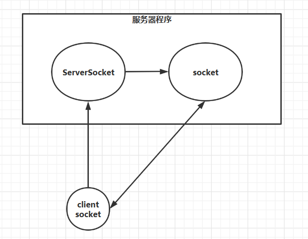

IO过程:客户端程序---->客户端操作系统---->客户端网卡----->服务端网卡----->服务端操作系统----->服务端程序

# BIO

Blocking IO

BIO中有三个Socket，分别是服务器端监听的ServerSocket、客户端连接的Socket、客户端连上来后服务器端生成的用于和客户端通信的Socket



客户端

```java
import java.io.IOException;
import java.net.Socket;

public class Client {
    public static void main(String[] args) {
        try {
            //客户端socket
            Socket socket = new Socket("127.0.0.1",8080);

            socket.getOutputStream().write("111".getBytes());
            socket.close();
        } catch (IOException e) {
            e.printStackTrace();
        }
    }
}
```

服务器端

```java
import java.io.IOException;
import java.net.InetSocketAddress;
import java.net.ServerSocket;
import java.net.Socket;

public class BIO {

    static byte[] bytes = new byte[1024];

    public static void main(String[] args) {
        try {
            //第一个socket是ServerSocket,用于监听
            ServerSocket serverSocket = new ServerSocket();
            serverSocket.bind(new InetSocketAddress(8080));
            System.out.println("wait connect");
            /*
            第二个socket是当客户端连接后,返回一个和客户端通信的socket
            accept阻塞方法,监听到客户端连接上后会生成socket
            */
            Socket socket = serverSocket.accept();
            
            System.out.println("connect success");
            System.out.println("wait data");
            //阻塞方法 read表示读了多少字节
            int read = socket.getInputStream().read(bytes);
            System.out.println("data success");
            String content = new String(bytes);
            System.out.println(content);

        } catch (IOException e) {
            e.printStackTrace();
        }
    }
}
```

serverSocket的accept方法是阻塞方法，如果没有客户端连接，第一个的监听Socket就会一直等待，输出wait connect

当执行用户方法的时候，用户Socket连接上来后accept返回第二个socket，从第二个socket里获取输入输出

第二个socket的read是阻塞方法，如果客户端socket连接上后不执行 socket.getOutputStream().write("111".getBytes()); 那么服务端会一直阻塞

**总结：用于监听的Socekt的accept方法，和用于和用户通信的socket的inputStream().read方法都是阻塞方法**

**多线程BIO:用于监听的serverSocket发现客户端连接后都新建一个线程去处理才能实现并发**

**BIO问题：**

**1.用于监听的Socekt的accept方法，和用于和用户通信的socket的inputStream().read方法都是阻塞方法**

**2.多线程BIO里每一个客户端Socket连接客户端都要立刻开启一个处理线程，如果有1000万个用户连接，只有200万个是用户在工作，其他都没有read，结果是线程内存资源浪费+上下文切换**

# NIO

new IO / Non－blocking IO

NIO是对BIO的改进,BIO的阻塞的关键就是accept和read方法是阻塞方法

ServerSocket变成了ServerSocketChannel，用于和用户通信的Socket变成了SocketChannel，用户Socket没变

NIO对其进行了重新实现，将非阻塞accept read方法封装在里面

## 简单NIO思想

服务器端

```java
import java.io.IOException;
import java.net.InetSocketAddress;
import java.net.ServerSocket;
import java.net.Socket;
import java.nio.ByteBuffer;
import java.nio.channels.ServerSocketChannel;
import java.nio.channels.SocketChannel;
import java.util.ArrayList;
import java.util.List;

public class NIO {

    static byte[] bytes = new byte[1024];
    static List<SocketChannel> list = new ArrayList<>();
    static ByteBuffer byteBuffer = ByteBuffer.allocate(512);//Buffer组件
    public static void main(String[] args) {
        try {
            //ServerSocketChannel是监听Socket
            ServerSocketChannel serverSocketChannel = ServerSocketChannel.open();
            serverSocketChannel.bind(new InetSocketAddress(8080));
            //设置非阻塞
            serverSocketChannel.configureBlocking(false);

            while(true) {
                //SocketChannel是第二个socket,用于和用户socket通信
                SocketChannel socketChannel = serverSocketChannel.accept();
                if(serverSocketChannel == null) {
                    //没人连接
                    Thread.sleep(500);
                    for(SocketChannel client : list) {//相当于Selector
                        client.read(byteBuffer);
                        byteBuffer.flip();
                        System.out.println(byteBuffer.toString());
                    }
                } else {
                    //设置非阻塞
                    socketChannel.configureBlocking(false);
                    list.add(socketChannel);
                    for(SocketChannel client : list) {
                        client.read(byteBuffer);
                        byteBuffer.flip();
                        System.out.println(byteBuffer.toString());
                    }
                }
            }
        } catch (IOException e) {
            e.printStackTrace();
        } catch (InterruptedException e) {
            e.printStackTrace();
        }
    }
}
```

NIO的逻辑:

通过accept方法监听,方法改成了非阻塞

需要将连接上的和用户Socket通信的SocketChannel记录下来,循环看是否有对服务器的输入,因为用户可能打开了连接后一直不输入或者输入的很慢,如果没有这个记录那么每次打开新的SocketChannel之前的就丢掉了

没人连接的时候也要循环连接上的SocketChannel,因为如果一直没有人连接,并且之前的连接里有对服务器的输入了能及时看到

**上面这种单线程的实现for循环会造成资源浪费,当list里的socketChannel有千万个的时候,每次都要轮询一遍,很浪费时间**

于是将轮询的方式改为了感知数据是否到达的方式,而Java是没法做到的,操作系统有这方面的函数

于是Java服务器什么也不干,就等着数据,让操作系统去负责感知数据是否到达

**NIO把之前服务器程序负责的轮询的操作交给了操作系统**

windows操作系统的select()方法也是轮询,只有Linux系统的epoll()方法是感知到数据到达后通知相应的SocketChannel去read

## NIO组件

Selector


# 总结

BIO的阻塞体现在两个方面,一个是serverSocket.accept方法是阻塞方法,服务器端在有客户端连接前不能干别的事情,是阻塞的

二是socket.read方法是阻塞的,在客户端通过outputStream流传输的方式输出前,用于和用户通信的Socket什么事情也不能干,是阻塞的

流只能在一个方向上移动,包括inputStream outputStream