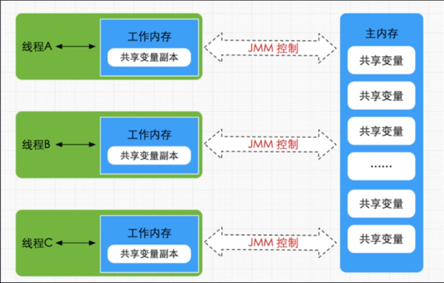
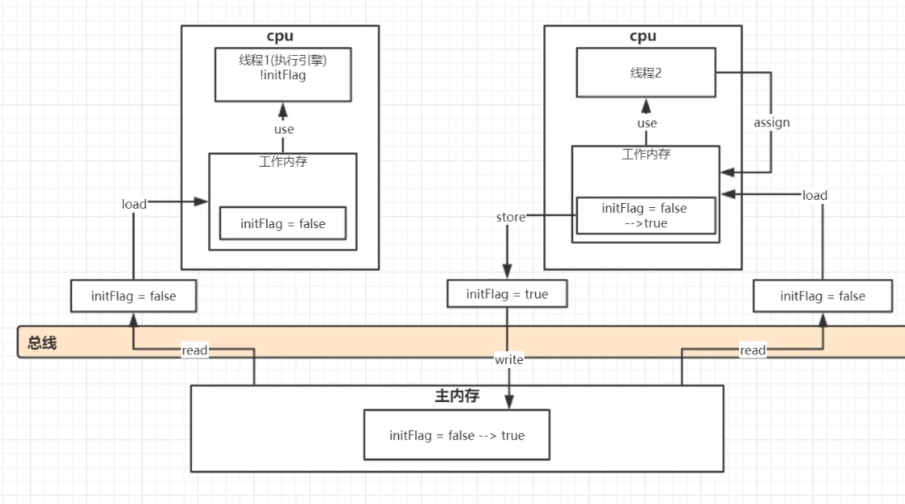
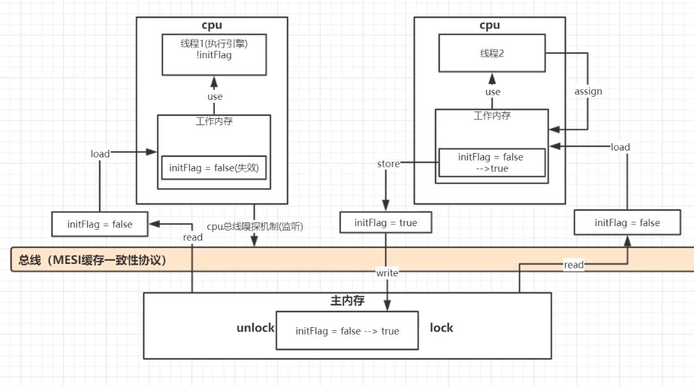

### 内存模型

所有的变量都存储在主内存中，每个线程还有自己的工作内存，工作内存存储在高速缓存或者寄存器中，保存了该线程使用的变量的主内存副本拷贝。

线程只能直接操作工作内存中的变量，不同线程之间的变量值传递需要通过主内存来完成。

<!--more-->

### 内存模型操作

Java 内存模型定义了 8 个操作来完成主内存和工作内存的交互操作

- read：从主内存读取数据
- load：将主内存读取到的数据写入工作内存
- use：从工作内存读取数据进行计算
- assign（赋值）：将计算好的值重新赋值到工作内存
- store：将工作内存数据写入主内存
- write：把 store 得到的值放入主内存的变量中
- lock：将主内存变量加锁，标识为线程独占
- unlock：将主内存变量解锁，解锁后其他线程可以锁定该变量

### 缓存不一致性解决方案

上面的lock、unlock是早期为了解决缓存不一致问题所采取的方案，总线加锁

#### 总线加锁

cpu从主内存中read数据前，要先对这个数据加锁lock，锁定该变量后，其他cpu的线程无法读或写这个数据，直到unlock解锁

这样就相当于串行，性能太低

#### MESI缓存一致性协议

多个cpu从主内存读取同一个数据到各自的高速缓存，当其中某个cpu修改了工作内存里的数据（assign后），数据会马上同步回主内存，其他cpu通过总线嗅探机制（相当于监听器、消息队列）可以感知到数据发生了变化，将自己缓存里的数据标识为失效，需要重新从主内存读

### Volatile

#### 缓存可见性实现原理/保证可见性

底层是lock汇编指令，每个Volatile变量做**修改**的代码，都会加一个lock前缀

lock前缀指令：将工作内存里该数据立即写回到主内存（store+write），开启MESI缓存一致性协议，锁住总线

锁总线：因为store已经在主内存了，只是没有write，会触发cpu总线嗅探，这个时候会read到旧值，为了避免这种情况，lock前缀指令会在store前lock住主内存的那个数据，直到write结束，保证store+write一起执行

#### 保证有序性

在 Java 内存模型中，允许编译器和处理器对指令进行重排序，重排序过程不会影响到单线程程序的执行，却会影响到多线程并发执行的正确性。

编译器在生成字节码时，会在指令序列中插入内存屏障来禁止特定类型的**处理器重排序**

| 屏障类型            | 指令示例                 | 说明                                                         |
| ------------------- | ------------------------ | ------------------------------------------------------------ |
| LoadLoad Barriers   | Load1;LoadLoad;Load2     | 确保Load1数据的装载先于Load2及所有后续装载指令               |
| StoreStore Barriers | Store1;StoreStore;Store2 | 确保Store1数据刷新到内存，先于Store2及所有后续存储指令       |
| LoadStore Barriers  | Load1;LoadStore;Store2   | 确保Load1数据装载先Store2及所有后续存储指令                  |
| StoreLoad Barriers  | Store1;StoreLoad;Load2   | 确保Store1数据刷新到内存，先于Load2及所有后续装载。StoreLoad Barriers会使该屏障之前的所有内存访问指令（存储和装载）完成之后，才执行该屏障之后的内存访问指令。 |

#### 不保证原子性

i++实际为load、Increment、store三个操作。

某一时刻线程1将i的值load取出来，放置到cpu缓存中，然后再将此值放置到寄存器A中，然后A中的值自增1（寄存器A中保存的是中间值，没有直接修改i，因此其他线程并不会获取到这个自增1的值）。如果在此时线程2也执行同样的操作，获取值i=10,自增1变为11，然后马上刷入主内存。此时由于线程2修改了i的值，实时的线程1中的i=10的值缓存失效，重新从主内存中读取，变为11。接下来线程1恢复。将自增过后的A寄存器值11赋值给cpu缓存i。这样就丢失了一次操作。

### happen-before

**程序次序规则**：在一个线程内，按照控制流顺序，书写在前面的操作先行发生于书写在后面的操作。

**管程锁定规则**：一个unlock操作先行发生于后面对同一个锁的lock操作

**volatile变量规则**：对一个变量的写操作先行发生于后面对这个变量的读操作

**线程启动规则**：Thread对象的start()方法先行发生于此线程的每一个动作

**线程终止规则**：线程中所有的操作都先行发生于线程的终止检测，我们可以通过Thread.join()方法结束、Thread.isAlive()的返回值手段检测到线程已经终止执行

**线程中断规则**：对线程interrupt()方法的调用先行发生于被中断线程的代码检测到中断事件的发生

**对象终结规则**：一个对象的初始化完成先行发生于他的finalize()方法的开始

**传递性**：如果操作A先行发生于操作B，而操作B又先行发生于操作C，则可以得出操作A先行发生于操作C