## 运行时数据区结构

文章来自[视频课程总结](https://www.bilibili.com/video/BV1kJ411g7C1)

<!--more-->

线程私有：虚拟机栈、本地方法栈、程序计数器

线程共享：堆、方法区

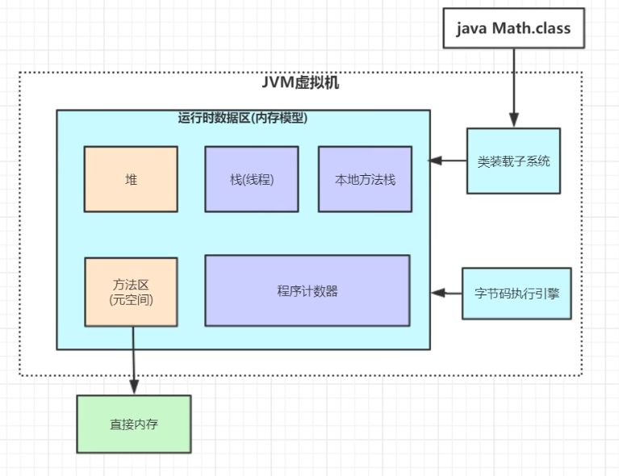

字节码执行引擎的作用：

1.修改程序计数器的值

2.去方法区中执行字节码

```java
//示例代码
public class Math {
	public static int initData = 666;
    public static User user = new User();
    
    public int compute() {
        int a = 1;
        int b = 2;
        int c = (a + b) * 10;
        return c;
    }
    public static void main(String[] args) {
        Math math = new Math();
        math.compute();
        System.out.println("test");
    }
}
```

通过Javap -c 命令反汇编，同时将内容放到Math.text中

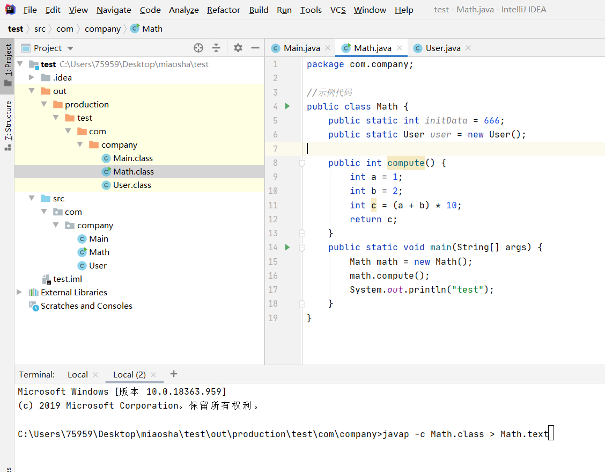


反汇编内容如下

```java
Compiled from "Math.java"
public class com.company.Math {
  public static int initData;

  public static com.company.User user;

  public com.company.Math();
    Code:
       0: aload_0
       1: invokespecial #1                  // Method java/lang/Object."<init>":()V
       4: return

  public int compute();
    Code:
       0: iconst_1
       1: istore_1
       2: iconst_2
       3: istore_2
       4: iload_1
       5: iload_2
       6: iadd
       7: bipush        10
       9: imul
      10: istore_3
      11: iload_3
      12: ireturn

  public static void main(java.lang.String[]);
    Code:
       0: new           #2                  // class com/company/Math
       3: dup
       4: invokespecial #3                  // Method "<init>":()V
       7: astore_1
       8: aload_1
       9: invokevirtual #4                  // Method compute:()I
      12: pop
      13: getstatic     #5                  // Field java/lang/System.out:Ljava/io/PrintStream;
      16: ldc           #6                  // String test
      18: invokevirtual #7                  // Method java/io/PrintStream.println:(Ljava/lang/String;)V
      21: return

  static {};
    Code:
       0: sipush        666
       3: putstatic     #8                  // Field initData:I
       6: new           #9                  // class com/company/User
       9: dup
      10: invokespecial #10                 // Method com/company/User."<init>":()V
      13: putstatic     #11                 // Field user:Lcom/company/User;
      16: return
}

```

## 虚拟机栈

### 栈帧

**JVM会为每个线程都分配一个栈**，利用栈的先进后出特性，用来做方法的调用

根据上面的示例代码，有一个主线程mian，那么会给它分配一个栈，主线程执行一个方法就在栈里面入栈一个栈帧，main线程先往栈中放一个main方法的栈帧，在main方法中执行的时候又执行到了compute方法，就继续入栈compute的栈帧，转到compute方法去执行

compute方法运行完毕的时候，compute的栈帧会出栈，接着main栈帧的内容接着执行

**栈帧里有局部变量表、操作数栈、动态链接、方法出口**

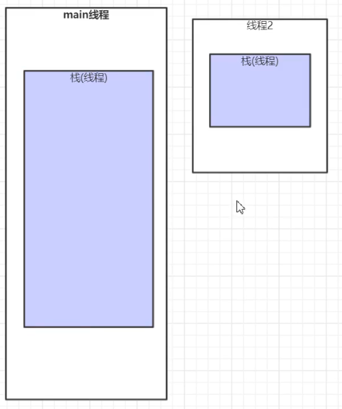

#### 局部变量表、操作数栈

观察compute的汇编指令，根据Java汇编手册可以翻译出来

```java
public int compute();
Code://注释里的1、2均代表下标
   0: iconst_1//将int类型常量1压入操作数栈                         int a = 1;
   1: istore_1//将int类型值常量出操作数栈，存入局部变量1             int a = 1;
   2: iconst_2//将int类型常量2压入操作数栈        		            int b = 2;
   3: istore_2//将int类型值常量出操作数栈，存入局部变量2             int b = 2;
   4: iload_1//从局部变量表1中装载int类型放到操作数栈                int c = (a + b) * 10;
   5: iload_2//从局部变量表2中装载int类型放到操作数栈                int c = (a + b) * 10;
   6: iadd//执行int类型的加法,从操作数栈弹出两个数,相加后放入操作数栈   int c = (a + b) * 10;
   7: bipush        10//把10入栈    							 int c = (a + b) * 10;
   9: imul//执行int类型的乘法,从操作数栈弹出两个数,相加后放入操作数栈   int c = (a + b) * 10;
  10: istore_3//将int类型值常量出操作数栈，存入局部变量3             int c = (a + b) * 10;
  11: iload_3//从局部变量表3中装载int类型放到操作数栈                int c = (a + b) * 10;
  12: ireturn//从操作数栈出栈,返回给上一个栈帧                      return c;
```

执行第0行，会将常量1（值为1）放到**操作数栈**暂存起来

执行第1行，在**局部变量表**中分配1号的空间用来代表a（第0号位置放的是this），操作数栈出栈，将常量1放到局部变量表1号位置

执行完 1: istore_1，Java虚拟机栈中的内容如下，在局部变量表中

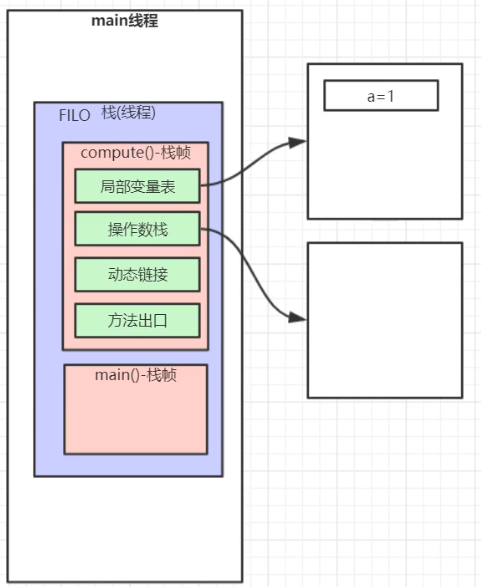

当执行到   4: iload_的时候，内部是这样的

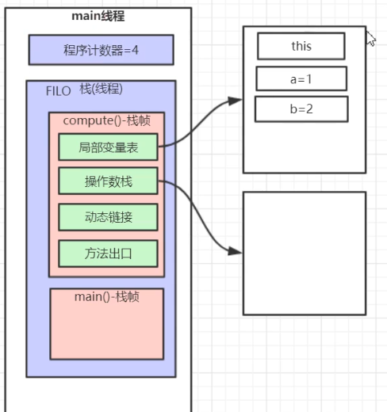

执行完第五行，操作数栈入栈了两个局部变量表的数，这里程序计数器应该为6

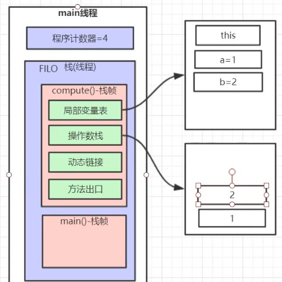

执行到第12行，把操作数栈中的30出栈返回给main方法，这里程序计数器应该为12

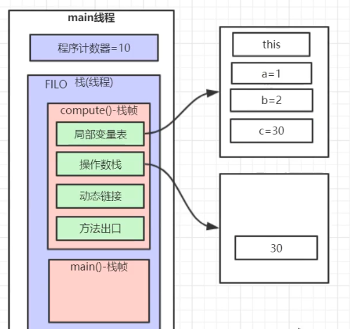

main方法栈帧的局部变量表中有一个Math对象，它和分配到堆里面的Math对象的联系就是局部变量表中的Math里放的是它在堆里面的地址

**堆和栈的关系**：栈里面有很多指针指向堆里面分配的对象

```java
public static void main(String[] args) {
    Math math = new Math();
    math.compute();
    System.out.println("test");
}
```

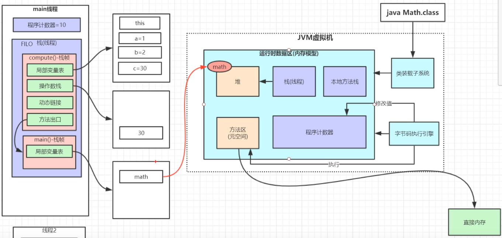

#### 动态链接

**将符号引用在程序运行过程中转变为直接引用**

听起来比较抽象，在示例代码中举个例子

```java
public static void main(String[] args) {
    Math math = new Math();
    math.compute();
    System.out.println("test");
}
```

这里new了一个math对象，math对象的对象头中类型指针指向了方法区的Math类的类元信息，类元信息有各个方法的名称和字节码

运行到math.compute()的时候，需要去找到compute方法的字节指令码去执行

math.compute()仅仅是个静态符号，要去对象头指向的类元信息里去找方法的字节码地址

找到以后将直接引用放到main方法的栈帧的动态链接里

动态链接的意思就是在程序运行过程中将一系列的静态符号根据对象的对象头找到方法对应的指令码入口地址，把方法入口的地址存到栈帧的动态链接中

- 部分符号引用在类加载阶段(解析)的时候就转化为直接引用,这种转化为**静态链接**

  将**常量池**中的符号引用转换成地址，它指向该类的方法在方法区中的内存位置

- 部分符号引用在运行期间转化为直接引用,这种转化为**动态链接**

  将编译器确定不下来的符号引用转换成地址，例如多态，指向该方法在方法区中的内存位置
  
  这里多态体现在了需要知道局部变量表指向的堆的对象究竟是谁

#### 方法出口

compute方法执行完要return c，return给谁，返回到哪里接着执行？要看方法出口

正常退出的情况下，示例里面compute方法的栈帧里的方法出口就记录了math.compute()的行号，就是程序计数器的值

返回的时候带着出栈的操作数，返回到main方法栈帧和compute方法的方法出口记录的行号

异常退出的情况下，需要查异常表来确定方法出口地址

返回以后栈帧出栈，恢复下一个栈帧的状态

## 程序计数器

记录了正在执行的虚拟机字节码指令的地址

```java
public int compute();
Code:
   0: iconst_1//将int类型常量1压入操作数栈 //先读到a=1的右边
   1: istore_1//将int类型值常量1出栈（操作数栈），存入局部变量1（1是第1号位置代表a）//a=1的左边
   2: iconst_2//将int类型常量2压入操作数栈
   3: istore_2//将int类型值存入局部变量2
   4: iload_1//
   5: iload_2
   6: iadd
   7: bipush        10
   9: imul
  10: istore_3
  11: iload_3
  12: ireturn
```

比如现在执行到了4: iload_1，那么程序计数器就存放4

## 方法区

Math**.class文件通过类装载子系统，装载到方法区中**

JDK1.8之前是永久代的实现，JDK1.8改成了元空间的实现

具体的演进看这个[博文](https://blog.csdn.net/alex6586/article/details/107757796)

class文件里有常量池Constant Pool，用于存放各种编译器生成的字面量、符号引用，**常量池经过类加载将存放到方法区的运行时常量池**

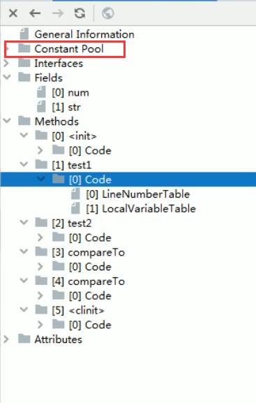

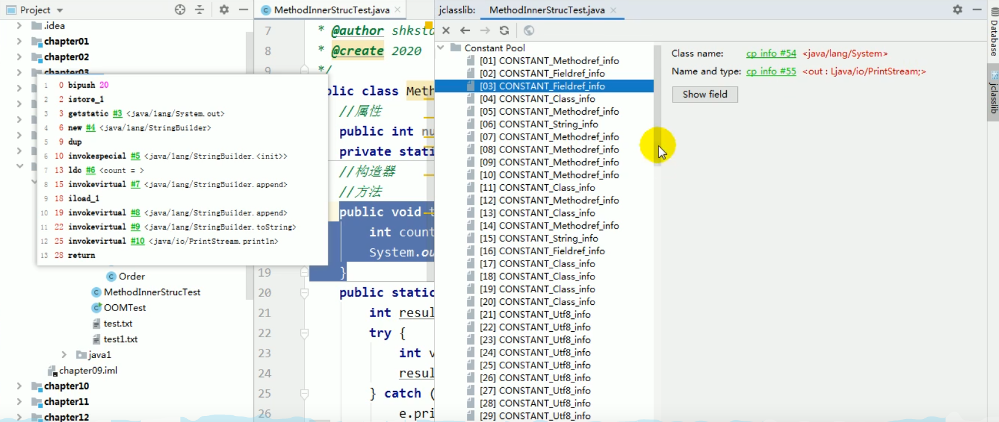

运行时常量池比Class文件常量池具有动态性，System.out.println在Class文件常量池中是System字面量、out字面量、println字面量，而在运行时常量池中就变成了真实的地址

**内部存放运行时常量池+类元信息**

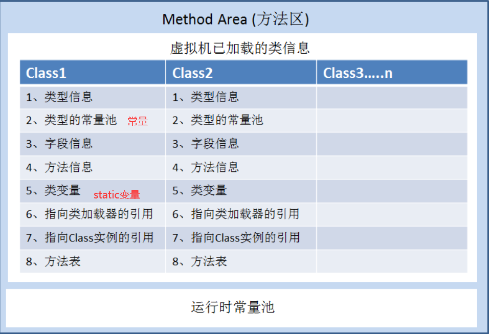

String常量池是运行时常量池的一部分，JDK7把String常量池+静态变量从方法区移到了堆里，JDK8把永久代方法区改成了元空间

类元信息包括了类全限定名、修饰符；字段名称、修饰符；方法名称、修饰符、返回值等等


示例中Math类有两个静态变量

```java
public static int initData = 666;
public static User user = new User();
```

这两个就要放在方法区中，User实例化后放在了堆里，方法区的User和堆的User有什么联系？

方法区的User是指针指向了堆里的User

**方法区的静态变量如果是引用类型，就会指向堆里的实例**


不仅方法区会有指针指向堆，堆里面的实例也是有指针指向方法区的

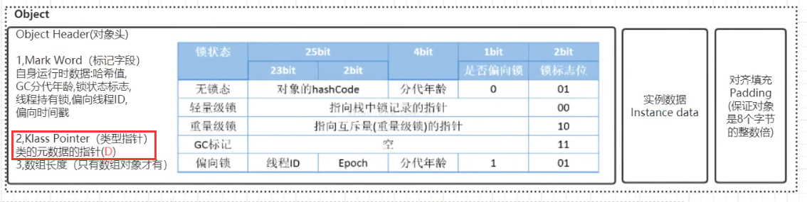

**每个实例对象都有一个对象头+实例数据+填充组成，而对象头又有三部分组成：MarkWord+Klass Pointer+数组长度**

这里的Klass Pointer就是类型指针

```java
Math math = new Math();
```

当new了一个Math对象的时候，堆里的math的对象头的类型指针就会指向方法区中的Math类的类元信息

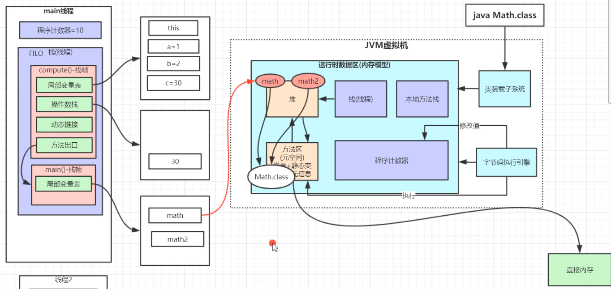

**栈里的局部变量表的引用类型会指向堆，方法区的引用类型静态变量会指向堆**

**堆里对象的对象头的类型指针会指向方法区的类元信息**

## 本地方法栈

和虚拟机栈的作用一样，不过服务的是本地native方法

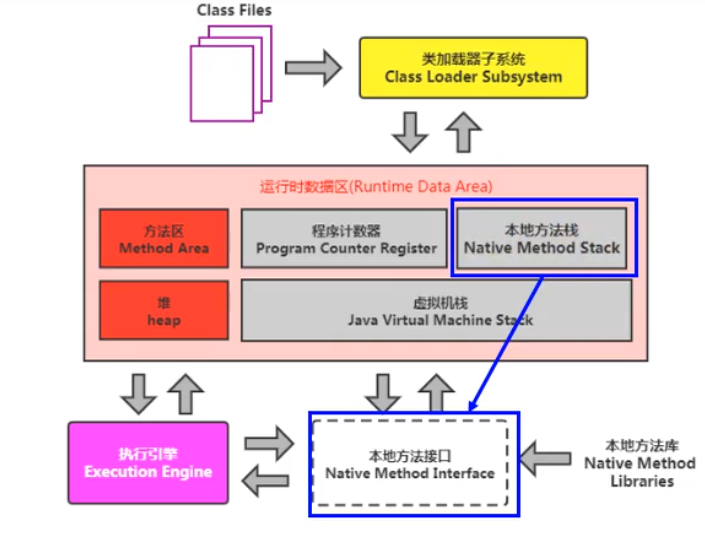


## 堆

堆里面有年轻代、老年代

年轻代又分伊甸园区、幸存者区

幸存者区分From区和To区

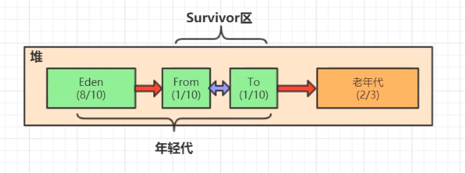

如果给堆分配600M，老年代占2/3 400M，年轻代占1/3 200M

年轻代伊甸园区占8/10 160M，幸存者区2/10 40M
