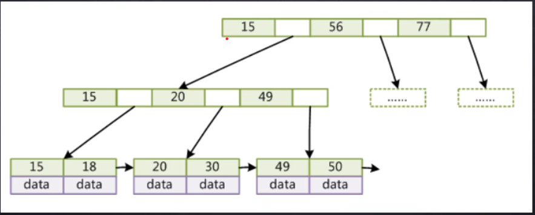

**索引是帮助MySQL高效获取数据的排好序的数据结构**

## 数据结构

### 红黑树


红黑树是一个二叉平衡树

红黑树的缺点：海量数据的时候红黑树的树高会非常大，查找次数会变大

### Hash表

哈希索引没办法找区间，比如select * from account where a > 10，因为只能一个一个找

而B树可以先查到a=10，然后通过指针顺序遍历

### B-tree

#### B树


b树所有索引元素不重复，节点中的数据索引从左到右递增排列

#### B+树



非叶子节点存储冗余索引，叶子节点包含所有索引字段，叶子节点用指针连接

## 多列索引最左前缀原理

如果索引了多列，要遵循最左前缀法则，指的是查询从索引的最左前列开始并且不跳过索引中的列


有三条SQL语句

```sql
select * from employees where name = 'Bill' and age = 31;
select * from employees where age = 30 and position = 'dev';
select * from employees where position = 'manager';
```

第一条语句先比较name，找到Bill后再比较age

第二条语句没有用到索引第一个字段，叶子节点的age横向看并没有排好序

如果不是按照索引列的顺序进行查找，则无法使用索引

多列索引的其他详解看[这里](https://blog.csdn.net/weixin_42845574/article/details/88913066)

