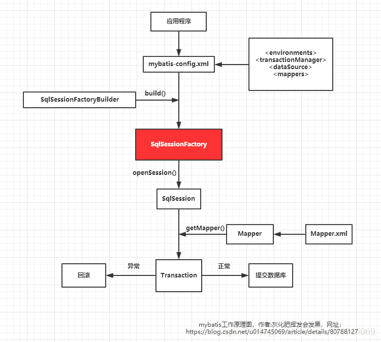

SqlSessionFactoryBuilder：根据配置文件生成的Configuration对象生成SqlSessionFactory

SqlSessionFactory：用于创建SqlSession的工厂类

SqlSession：MyBatis核心组件，用于向数据库执行SQL

Mapper接口：就是DAO接口

Mapper映射器：用于编写SQL，并将SQL和实体类映射，采用XML和注解均可实现



1.创建SqlSessionFactoryBuilder对象，调用build(inputstream)方法读取并解析配置文件，返回SqlSessionFactory对象。SqlSessionFactory里有Configuration对象

```java
public class DefaultSqlSessionFactory implements SqlSessionFactory {
    private final Configuration configuration;
```

解析配置文件信息的本质就是创建Configuration对象，将解析的xml数据封装到Configuration内部的属性中。Configuration对象的结构和xml配置文件的对象几乎相同。里面有properties（属性），settings（设置）mappers（映射器）等对象。

```java
public class Configuration {
    protected final MapperRegistry mapperRegistry;
    protected final Map<String, MappedStatement> mappedStatements;
   	//...
```

当解析mappers标签时，它会判断解析到的是mapper配置文件时，会再将对应配置文件中的增删改查标签一 一封装成MappedStatement对象，存入mappedStatements中。

MappedStatement与Mapper配置文件中的一个SQL对应，主要用途是描述一条SQL语句。
一个select标签会在初始化配置文件时被解析封装成一个MappedStatement对象，然后存储在Configuration对象的mappedStatements属性中，mappedStatements 是一个HashMap，存储时key = namespace + id，value = 对应的MappedStatement对象。

当判断解析到接口时，会创建此接口对应的MapperProxyFactory对象，存入mapperRegistry的knownMappers中，key = 接口的字节码对象，value = 此接口对应的MapperProxyFactory对象。

2.通过SqlSessionFactory构造SqlSession
SqlSession中的两个最重要的参数，configuration与初始化时的相同，Executor为执行器。Executor也是一个接口，他有三个常用的实现类BatchExecutor（重用语句并执行批量更新），ReuseExecutor（重用预处理语句prepared statements），SimpleExecutor（普通的执行器，默认）。

3.执行SqlSession.selectOne(namespace+id)方法时，会获取相应的MappedStatement，交给executor去执行
执行SqlSession.getMapper(Mapper接口的字节码对象)方法是，会去获取Configuration对象的MapperRegistry的Map<Class<?>, MapperProxyFactory<?>> knownMappers，拿到对应的MapperProxyFactory动态代理工厂，去生成相应的实例执行方法