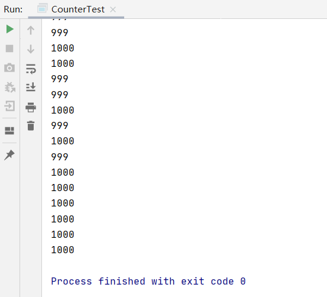
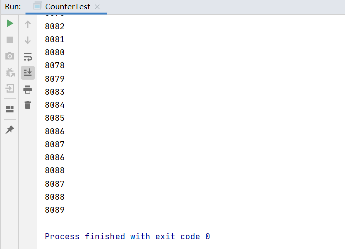

**Spring 的 bean 作用域（scope）类型**
1、singleton:单例，默认作用域。

2、prototype:原型，每次创建一个新对象。

3、request:请求，每次Http请求创建一个新对象，适用于WebApplicationContext环境下。

4、session:会话，同一个会话共享一个实例，不同会话使用不用的实例。

5、global-session:全局会话，所有会话共享一个实例。

线程安全这个问题，要从单例与原型Bean分别进行说明。

**原型Bean**
对于原型Bean,每次创建一个新对象，也就是线程之间并不存在Bean共享，自然是不会有线程安全的问题。

**单例Bean**
对于单例Bean,所有线程都共享一个单例实例Bean,因此是存在资源的竞争。

如果单例Bean,是一个无状态Bean，也就是线程中的操作不会对Bean的成员执行查询以外的操作，那么这个单例Bean是线程安全的。比如Spring mvc 的 Controller、Service、Dao等，这些Bean大多是无状态的，只关注于方法本身。

**有状态bean：**调用bean的方法会使bean的字段属性发生改变

**无状态bean**：调用bean的方法不会使bean的字段属性发生改变

下面看一个例子

计数类Counter

```java
package com.it;

public class Counter {
    private int count = 0;

    public void addAndPrint() {
        try {
            Thread.sleep(10);
        } catch (InterruptedException e) {
            e.printStackTrace();
        }
        System.out.println(++count);
    }
}

```

xml配置

```xml
<?xml version="1.0" encoding="UTF-8"?>
<beans xmlns="http://www.springframework.org/schema/beans"
       xmlns:xsi="http://www.w3.org/2001/XMLSchema-instance"
       xmlns:context="http://www.springframework.org/schema/context"
       xsi:schemaLocation="http://www.springframework.org/schema/beans http://www.springframework.org/schema/beans/spring-beans.xsd http://www.springframework.org/schema/context https://www.springframework.org/schema/context/spring-context.xsd">
<!--    <bean id="userDao" class="com.it.dao.impl.UserDaoImpl" init-method="init" destroy-method="destory"></bean>-->
<!--    <bean id="userDao" class="com.it.factory.StaticFactory" factory-method="getUserDao"></bean>-->
    <bean id="counter" scope="prototype" class="com.it.Counter"></bean>
</beans>
```

测试类

```java
package com.it;

import org.springframework.context.ApplicationContext;
import org.springframework.context.support.ClassPathXmlApplicationContext;

public class CounterTest {
    public static void main(String[] args) {
        final ApplicationContext context = new ClassPathXmlApplicationContext("applicationContext.xml");
        for (int i = 0; i < 10; i++) {
            new Thread() {
                @Override
                public void run() {
                    Counter counter = (Counter) context.getBean("counter");
                    for (int j = 0; j < 1000; j++) {
                        counter.addAndPrint();
                    }
                }
            }.start();
        }
    }
}
```

经过测试，scope为prototype时是线程安全的，因为每个线程的counter对象都是新new的。输出如下



scope为singleton时不是线程安全的，所有的线程会公用同一个Bean。输出如下



**如果把private int count = 0;改为private static int count = 0;测试发现singleton和prototype均不是线程安全的**

这是因为static变量属于Counter类，当加载Counter类的时候就初始化了count变量，即使prototype每次都创建新的Counter类，但是仍然会共用一个count变量。

**结论：**

当Bean的作用域为singleton，对Bean的非静态和静态成员变量写操作时，会出现线程安全问题

当Bean的作用域为prototype，对Bean的静态成员变量写操作时，会出现线程安全问题