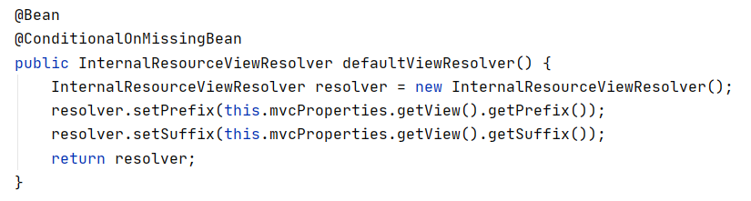
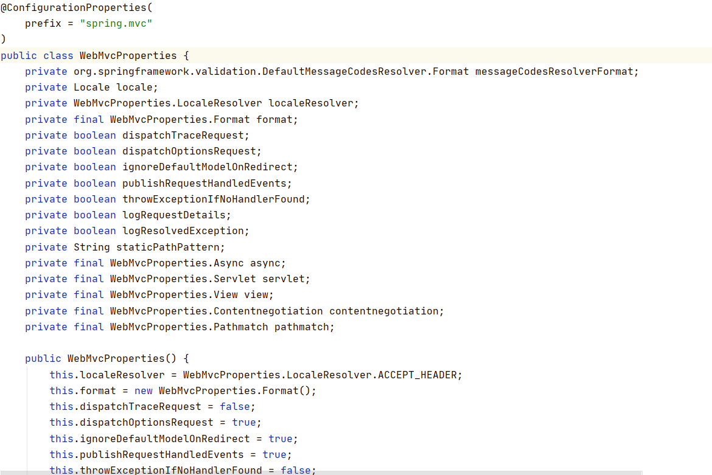
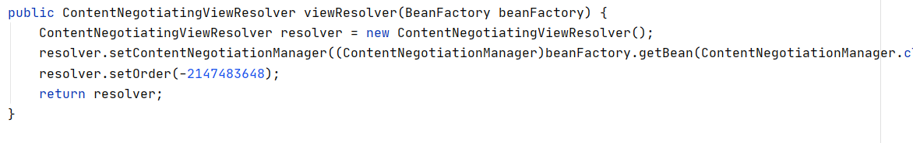

今天学到Spring Boot里嵌入式Servlet配置和启动的源码

#### 定制嵌入式Servlet的相关配置的两种方式

发现以往定制嵌入式Servlet的相关配置都是使用两种方式，一是在properties或者yml文件中写servlet.port=8081、servlet.tomcat.uri-encoding=UTF-8这种，二是新建一个类继承EmbeddedServletContainerCustomizer（内嵌Servlet容器定制器），重写里面的customize方法。

<!--more-->

#### 两种方式的工作原理

EmbeddedServletContainerAutoConfiguration这个类是内置Servlet容器的自动配置类

这个自动配置类会创建EmbeddedServletContainerFactory内置Servlet容器工厂，这个工厂包含有三种，分别是TomcatEmbeddedServletContainerFactory、JettyEmbeddedServletContainerFactory、UndertowEmbeddedServletContainerFactory。

工厂会在需要的时候创建EmbeddedServletContainer内置Servlet容器，同样这个类也包含三种，分别是TomcatEmbeddedServletContainer、JettyEmbeddedServletContainer、UndertowEmbeddedServletContainer。

EmbeddedServletContainerAutoConfiguration内置Servlet容器自动配置类引入了EmbeddedServletContainerCustomizerBeanPostProcessor内置Servlet容器定制化对象后置处理器类，这个后置处理器的作用就是在Servlet容器初始化之前，从容器中获取所有的定制器（EmbeddedServletContainerCustomizer），调用每一个定制器的customize方法来给Servlet容器进行属性赋值。

这就对应了上面定制嵌入式Servlet的相关配置的方式，我写了一个配置类（@Configuration）继承了EmbeddedServletContainerCustomizer，将它放在容器中（@Bean），之后自动配置类创建了工厂，工厂在创建Serlvet容器时，会通过后置处理器类，将容器中所有的定制化组件的方法执行一遍。

**为什么在properties或者yml文件的配置也会生效呢？**

因为ServerProperties类也是实现了EmbeddedServletContainerCustomizer接口，所以它也是内嵌Servlet容器定制器的一种

properties和yml的加载就是说到SpringBoot的自动配置原理了

#### SpringBoot自动配置原理

SpringBoot在启动的时候加载主配置类，上面有@EnableAutoConfiguration，这个注解通过EnableAutoConfigurationImportSelector给容器添加了各种自动配置类AutoConfiguration（如果我们实现的功能没有自动配置类就需要我们自己写，有就用SpringBoot自带的）

自动配置类上的@ConfigurationProperties(perfix = "spring.http.encoding")注解的作用是把我们自己写的application.properties或者yml里的配置和这个自动配置类上的属性进行映射，比如是否存在spring.http.encoding开头的配置，有就赋值并生成相应的properties对象，比如HttpEncodingProperties，将properties对象放在容器中。

自动配置类初始化各种组件的时候，有时候AutoConfiguration类的生成组件方法上有@ConditionalOnMissingXXX，意思是如果组件对象在容器中，那么就不重复生成了。

具体的生成过程是：组件的各种定制器（xxxCustomizer、xxxConfigurer）既可以有我们自己设置的，也可以有SpringBoot帮我们生成的，而Spring Boot帮我们生成的对象所用的值就会从properties对象中获取属性，properties对象如果我们有在properties文件yml文件中设置属性值就用我们的，否则就用默认的。（properties对象的构造方法就初始化了很多默认值，然后再在配置文件里寻找对应的赋值）

**举个例子**

WebMvcAutoConfiguration自动配置类下有个ViewResolver视图解析器组件，下面这个图是它在AutoConfiguration里的创建方法。

@ConditionalOnMissingBean如果容器内没有ViewResolver就创建一个，创建使用了this.mvcProperties，也就是上面说的通过扫描我们创建的配置文件结合Spring Boot自带的默认值构造的properties对象。

下面是properties类和它的构造方法

WebMvcAutoConfiguration自动配置类下还有一个生成视图解析器的方法

ContentNegotiatingViewResolver组合容器中所有的视图解析器

##### 总结

SpringBoot在启动的时候加载主配置类，上面有@EnableAutoConfiguration，这个注解通过EnableAutoConfigurationImportSelector给容器添加了各种自动配置类AutoConfiguration

自动配置类会帮我们生成一些组件，组件的定制化有两种方式，一是通过在application.properites和yml文件里配置，二是通过继承xxxConfigurer/xxxCustomizer类，实现里面的定制化方法，将这个类放到容器中

第一个方法的原理是，自动配置类会生成一个properties对象，自动配置类上的@ConfigurationProperties(perfix = "spring.http.encoding")注解的作用是把我们自己写的application.properties或者yml里的配置和这个自动配置类上的属性进行映射，如果没有配置的属性就使用默认的，生成组件依靠这个properties对象

第二个方法的原理是，自动配置类会通过后置处理器类，在生成组件后，初始化组件之前，找到容器中有关的定制器类，执行这些定制器类的定制化方法，初始化组件。

#### 如何修改SpringBoot的默认配置

SpringBoot在自动配置很多组件的时候，先看容器中有没有用户自己配置的（@Bean、@Component）如果有就用用户配置的，如果没有，才自动配置；如果有些组件可以有多个（比如ViewResolver）将用户配置的和自己默认的组合起来（**可以借助implements xxxCustomizer、xxxConfigurer，也可以借助直接implements要实现的组件类等其他的方式**）；

在SpringBoot中会有非常多的xxxConfigurer帮助我们进行扩展配置

在SpringBoot中会有很多的xxxCustomizer帮助我们进行定制配置