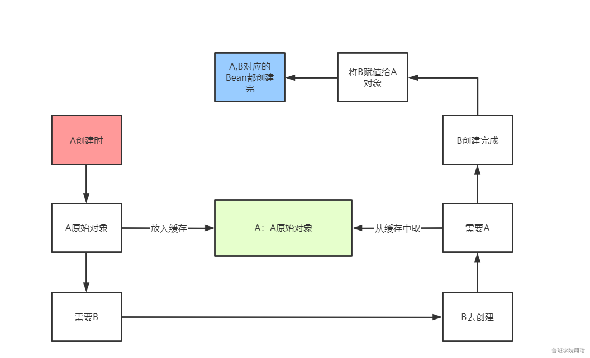

## Bean的创建生命周期

1.通过配置扫描路径扫描类Class，得到BeanDefinition

2.通过BeanDefiniton和反射创建对象

3.填充属性（通过Setter进行依赖注入）

4.BeanPostProcessor.postProcessBeforeInitialization()加工

5.InitializingBean.afterPropertiesSet()方法对属性进行设置

6.init-method

7.BeanPostProcessor.postProcessAfterInitialization()加工

8.Bean被放到单例池中SingletonObjects

## 循环依赖案例

Bean的生命周期-AService

1.通过配置扫描路径扫描类Class，得到BeanDefinition

2.通过BeanDefiniton和反射创建对象

3.填充属性（依赖注入） ----> 单例池找BService ---->找不到 ---->创建BService的Bean


此时去创建BService

Bean的生命周期-BService

1.通过配置扫描路径扫描类Class，得到BeanDefinition

2.通过BeanDefiniton和反射创建对象

3.填充属性（依赖注入） ----> 单例池找AService ---->找不到 ---->创建AService的Bean


到这里出现了循环依赖


#### 加入一级缓存



Bean的生命周期-AService

1.通过配置扫描路径扫描类Class，得到BeanDefinition

2.通过BeanDefiniton和反射创建对象 ---->将原始对象放到缓存Map<beanName,bean>中

3.填充属性（依赖注入） ----> 单例池找BService ---->找不到 ---->在缓存Map中找---->找不到创建BService


Bean的生命周期-BService

1.通过配置扫描路径扫描类Class，得到BeanDefinition

2.通过BeanDefiniton和反射创建对象 ---->将原始对象放到缓存Map<beanName,bean>中

3.填充属性（依赖注入）----> 单例池找AService ---->找不到--->在缓存Map里找----->找到了填充属性

成功构造出BService以后AService也能顺利创建

**问题：如果在AService的BeanPostProcessor后置处理器中返回了一个新的AService对象，那么这个新的对象会被放在单例池中，而赋值给BSerice的AService却是原始对象，会报错，因为IOC容器是单例的但是却有两个AService**

**BeanPostProcessor.postProcessBeforeInitialization()的返回值会被放在IOC容器中作为本次初始化的Bean**

**同样的道理，BeanPostProcessor因为可以实现AOP功能，也就是在postProcessAfterInitialization中创建代理对象，将代理对象返回放在容器中，所以也会出现两个对象打破单例规则**

#### 提前生成代理对象放到缓存

Bean的生命周期-AService

1.通过配置扫描路径扫描类Class，得到BeanDefinition

2.通过BeanDefiniton和反射创建对象 ---->SmartBeanPostProerssor产生代理对象---->将代理对象放到缓存Map<beanName,bean>中

3.填充属性（依赖注入） ----> 单例池找BService ---->找不到 ---->在缓存Map中找---->找不到创建BService


Bean的生命周期-BService

1.通过配置扫描路径扫描类Class，得到BeanDefinition

2.通过BeanDefiniton和反射创建对象 ---->SmartBeanPostProerssor产生代理对象---->将代理对象放到缓存Map<beanName,bean>中	

3.填充属性（依赖注入） ----> 单例池找AService ---->找不到--->在缓存Map里找----->找到了填充属性

成功构造出BService以后AService也能顺利创建

**问题：正常的代理对象是在第7步的后置处理器中产生的，现在提前到了第2步**

**但是不是所有的对象都要在第2步产生代理对象，有些需要在第7步产生代理对象**

**只有在循环依赖的情况下才需要在第2步提前产生代理对象**

**可以提前生成代理对象，里面织入了增强方法，只不过Object target里的属性还没赋值罢了**

**提前完成了AOP的功能后在底下的后置处理器中会判断是否完成了AOP功能，提前完成了就不再进行AOP**

#### lamda表达式优化

Bean的生命周期-AService

1.通过配置扫描路径扫描类Class，得到BeanDefinition

2.通过BeanDefiniton和反射创建对象 ---->将BeanName和原始对象的关系映射放到Map<beanName,lamda(原始对象)>里

3.填充属性（依赖注入） ----> 单例池找BService ---->找不到 ---->在缓存Map中找---->找不到创建BService


Bean的生命周期-BService

1.通过配置扫描路径扫描类Class，得到BeanDefinition

2.通过BeanDefiniton和反射创建对象 ---->将BeanName和原始对象的关系映射放到Map<beanName,lamda(原始对象)>里

3.填充属性（依赖注入） ----> 单例池找AService 找不到 ---->在缓存Map中找---->找到了对应的关系lamda(原始对象)---->执行lamda(原始对象)---->提前得到代理对象

成功构造出BService以后AService也能顺利创建

**使用了懒加载的思想，用到了才会去提前创建代理对象，解决了所有情况都提前产生代理对象的情况，当出现循环依赖的时候才执行lamda表达式，lamda表达式替换了之前的代理对象**

**这里的单例池就是一级缓存，缓存Map<beanName,lamda(原始对象)>就是三级缓存**


**问题：如果有一个CService和AService也是循环依赖，那么AService需要注入BService的时候，BService在三级缓存中找到了lamda表达式执行了产生了代理对象，注入BService成功了，又需要注入CService，CService也找到了lamda表达式，也执行了一次，产生了两个代理对象，又不是单例了**

#### 加入二级缓存

Bean的生命周期-AService

1.通过配置扫描路径扫描类Class，得到BeanDefinition

2.通过BeanDefiniton和反射创建对象 ---->将BeanName和原始对象的关系映射放到Map<beanName,lamda(原始对象)>里

3.填充属性（依赖注入） ----> 单例池找BService ---->找不到 ---->在缓存Map中找---->找不到创建BService


Bean的生命周期-BService

1.通过配置扫描路径扫描类Class，得到BeanDefinition

2.通过BeanDefiniton和反射创建对象 ---->将BeanName和原始对象的关系映射放到Map<beanName,lamda(原始对象)>里

3.填充属性（依赖注入） ----> 单例池找AService 找不到 ---->在缓存Map中找---->找到了对应的关系lamda(原始对象)---->执行lamda(原始对象)---->提前得到代理对象----->放到二级map<beanName,代理对象>里


Bean的生命周期-CService

1.通过配置扫描路径扫描类Class，得到BeanDefinition

2.通过BeanDefiniton和反射创建对象 ---->将BeanName和原始对象的关系映射放到Map<beanName,lamda(原始对象)>里

3.填充属性（依赖注入） ----> 单例池找AService 找不到 ---->在二级Map中找----->提前得到代理对象（二级没找到才去三级map里面找---->找到了对应的关系lamda(原始对象)---->执行lamda(原始对象)---->得到代理对象----->放到二级缓存中去）


**一级缓存（SingletonObjects）：单例池map**

**二级缓存（earlySingletonObjects）：map<beanName,代理对象>**

**三级缓存（ singletonFactories）：map<beanName,lamda(原始对象)>**


## 源码

```java
    protected Object getSingleton(String beanName, boolean allowEarlyReference) {
        //先去一级缓存单例池中找
        Object singletonObject = this.singletonObjects.get(beanName);
        //一级没找到并且还要创建
        if (singletonObject == null && this.isSingletonCurrentlyInCreation(beanName)) {
            synchronized(this.singletonObjects) {
                //去二级缓存中找
                singletonObject = this.earlySingletonObjects.get(beanName);
                //二级缓存没找到
                if (singletonObject == null && allowEarlyReference) {
                    //去三级缓存中找
                    ObjectFactory<?> singletonFactory = (ObjectFactory)this.singletonFactories.get(beanName);
                    //lamda表达式不为空
                    if (singletonFactory != null) {
                        //执行lamda表达式获取代理对象
                        singletonObject = singletonFactory.getObject();
                        //将代理对象放到二级缓存中
                        this.earlySingletonObjects.put(beanName, singletonObject);
                        //移出三级缓存的lamda表达式
                        this.singletonFactories.remove(beanName);
                    }
                }
            }
        }

        return singletonObject;
    }
```

## 构造方法注入的循环依赖

上面是setter注入的循环依赖问题，可以通过三级缓存解决，因为在通过反射创建了对象以后，它的属性填充是滞后的，也就是可以通过已经创建了但内部属性还没赋值的对象去包装成代理对象，暴露给外部，让依赖它的Bean能够获得这个代理对象，从而完成属性的赋值

通过构造方法注入形成的循环依赖则无法通过三级缓存来解决，因为需要先使用构造方法的参数去实例化对象以后，才能获得对象的引用。而不是像setter那样，先得到了对象的引用再进行赋值。