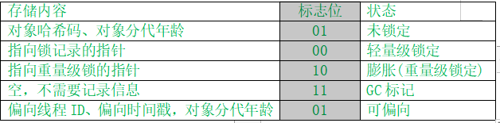

每个Java对象都可以在Mark Word对象头关联一个Monitor对象（操作系统层面），ObjectMonitor中有几个关键属性：

- _owner：指向持有ObjectMonitor对象的线程
- _WaitSet：存放处于wait状态的线程队列
- _EntryList：存放处于等待锁block状态的线程队列
- _recursions：锁的重入次数 
- _count：用来记录该线程获取锁的次数

```hpp
ObjectMonitor() {
_header       = NULL;
_count        = 0;
_waiters      = 0,
_recursions   = 0;
_object       = NULL;
_owner        = NULL;
_WaitSet      = NULL;
_WaitSetLock  = 0 ;
_Responsible  = NULL ;
_succ         = NULL ;
_cxq          = NULL ;
FreeNext      = NULL ;
_EntryList    = NULL ;
_SpinFreq     = 0 ;
_SpinClock    = 0 ;
OwnerIsThread = 0 ;
}
```

<!--more-->

wait/notify原理：Owner线程发现条件不满足，使用wait方法可以进入WaitSet变成等待状态，等待状态的线程会在Owner线程调用notify或notifyAll唤醒，唤醒后不会立刻获得锁，会进入EntryList重新竞争


Synchronized代码块对应MonitorEnter、MonitorExit字节码

MonitorEnter：将对象头的Mark Word（HashCode、分代年龄Age等等）替换为指向Monitor的指针，在Monitor对象里进行后续操作

MonitorExit：Owner设置为null并唤醒Monitor对象的Entry List，将对象头MarkWord替换回来





### 轻量级锁

线程在执行同步块之前，JVM会先在当前线程的栈帧中创建轻量级锁记录（锁记录地址、轻量级标志、要替换的锁对象地址），将锁记录的地址和轻量级锁标志CAS替换对象头中的Mark Word（Hashcode、分代年龄）。替换成功获得锁，失败则进行检查，看锁记录地址是否是自己线程里的一条锁记录，是自己的就发生重入，不是进行锁膨胀。

如果有锁重入则发现Mark Word中的锁记录地址是线程中的一个锁记录，则几条锁记录都放在栈帧里
解锁的时候栈帧弹出一条条锁记录，弹到最后一条的时候将里面记录的Mark Word用CAS替换回去，替换成功解锁成功，否则锁膨胀。

### 锁膨胀

轻量级锁有两个地方会发生锁膨胀，一是获取轻量级锁失败， 二是轻量级解锁失败

如果线程A已经获取了轻量级锁，更改了MarkWord的值，线程B再CAS获取轻量级锁会失败，失败进行锁膨胀，因为轻量级锁没有Monitor，也没有Bolcked的地方，所以线程B会申请关联Monitor，将轻量级锁的MarkWord改为重量级锁Monitor，同时线程B到EntryList中阻塞

过段时间线程A的同步代码块执行完毕了，想CAS替换回最初的Mark Word(HashCode、age)，发现MarkWord被改了CAS失败，这时候线程A也走重量级锁的解锁流程，到Monitor中把Owner置为null，同时去EntryList唤醒阻塞线程

### 自旋锁

自旋锁发生在轻量级锁转重量级锁中，线程在申请重量级锁进入Entry List前会先自旋，如果自旋过程中CAS替换成功了，自己就可以避免阻塞（因为阻塞会发生上下文切换，费时间），自旋后锁还没释放，线程就申请重量级锁进入Entry List阻塞

自适应自旋锁：如果对象刚刚的自旋成功了，就多自旋几次，失败了就少自旋几次甚至不自旋

### 偏向锁

偏向锁是为了解决轻量级锁重入连续进行CAS并失败的问题，虽然都是自己重入，但每次都要生成一个锁记录，用锁记录替换Mark Word（CAS操作），失败后查看才发现是自己线程的锁记录

偏向锁先将线程ID替换到Mark Word里，之后只要线程ID是自己的，就不用重新CAS。线程执行同步块结束后不CAS替换回去，所以底下来了其他线程回去检查线程是否还存活

如果中途有其他线程来竞争该锁，它会首先暂停拥有偏向锁的线程，那么就会查看偏向锁记录的线程是否还存活，如果未存活，将对象头设置成无锁状态（将Mark Word从偏向锁设置为无锁，然后重新偏向当前竞争成功的线程）。如果当前线程还是存活状态，那么就升级成轻量级锁，在原获得偏向锁线程的栈帧中分配锁记录，CAS替换对象头Mark Word，如果原线程CAS成功，那么就从安全点继续执行。竞争该锁的线程也会创建锁记录并CAS替换，成功获得轻量级锁，失败自旋后申请重量级锁

### 锁消除

锁消除理解起来很简单，它指的就是虚拟机即使编译器在运行时，如果检测到那些共享数据不可能存在竞争，那么就执行锁消除。锁消除可以节省毫无意义的请求锁的时间。

