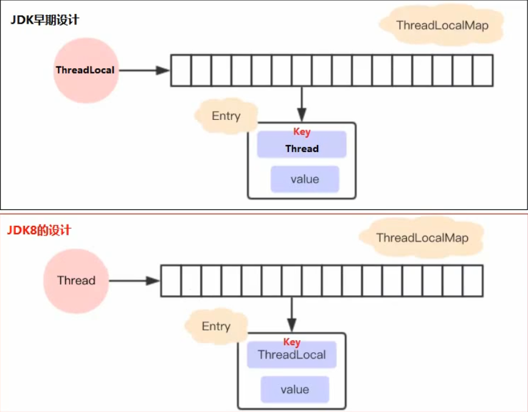
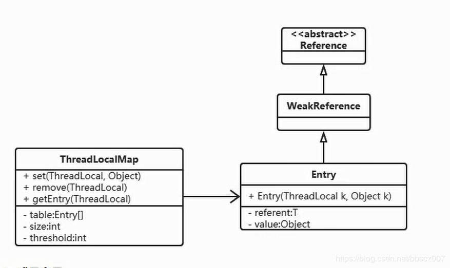
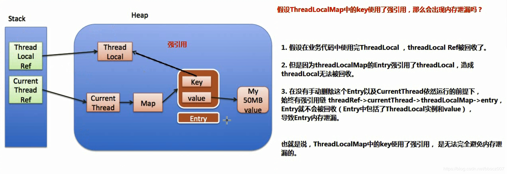
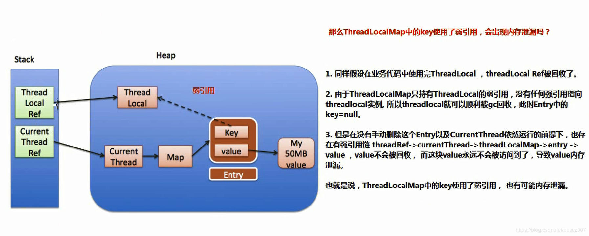

---

title: ThreadLocal底层原理
date: 2020-08-01 10:06:44
tags:
  - ThreadLocal
---

[TOC]

ThreadLocal类用来提供线程内部的局部变量

<!--more-->

### 底层设计



早期的设计是每个ThreadLocal维护一个ThreadLocalMap，里面的Entry<Thread,value>

JDK8的改进：每个Thread维护一个ThreadLocalMap，里面的Entry<ThreadLocal,value>

改进的好处：

1.每个Map存储的Entry数量变少 

2.当Thread销毁的时候，ThreadLocalMap也随之销毁

### ThreadLocalMap源码分析

#### 基本结构

ThreadLocalMap是ThreadLocal的静态内部类， 没有实现Map接口，用独立的方式实现了Map的功能， 其内部的Entry也是独立实现



#### 成员变量

```java
		/**
         * The initial capacity -- MUST be a power of two.
         * 初始化容量,必须是2的整数次幂
         */
        private static final int INITIAL_CAPACITY = 16;

        /**
         * 存放数据的table, 同样数组长度必须是2的整数次幂
         * The table, resized as necessary.
         * table.length MUST always be a power of two.
         */
        private Entry[] table;

        /**
         * 数组里entrys的个数,可以判断table是否超过阈值 (存储的格式)
         * The number of entries in the table.
         */
        private int size = 0;

        /**
         * 阈值 进行扩容的阈值,表使用大于他的时候,进行扩容
         * The next size value at which to resize.
         */
        private int threshold; // Default to 0

```

#### Entry结构

```java
	/**
     * The entries in this hash map extend WeakReference, using
     * its main ref field as the key (which is always a
     * ThreadLocal object).  Note that null keys (i.e. entry.get()
     * == null) mean that the key is no longer referenced, so the
     * entry can be expunged from table.  Such entries are referred to
     * as "stale entries" in the code that follows.
     翻译:
     * Entry继承WeakReference, 并且用ThreadLocal作为key
     * 如果key为null(entry.get() == null)意味着key不在被引用,因此这时候entry也可以从table
     * 中清除(被垃圾回收器回收) 
     */
    static class Entry extends WeakReference<ThreadLocal<?>> {
        /** The value associated with this ThreadLocal. */
        Object value;

        Entry(ThreadLocal<?> k, Object v) {
            super(k);
            value = v;
        }
    }
```
### 强弱引用和内存泄露

#### 内存泄漏相关概念

- 内存溢出: Memory overflow 没有足够的内存提供给申请者使用
- 内存泄漏: Memory Leak 程序中已经动态分配的堆内存由于某种原因, 程序未释放或者无法释放, 造成系统内部的浪费, 导致程序运行速度减缓甚至系统崩溃等严重结果. 内存泄漏的堆积终将导致内存溢出

#### 如果Key是强引用



#### 如果Key是弱引用



在以上两种内存泄漏的情况，都有两个前提：
 1.没有手动删除这个Entry	2.存在于线程池的环境中，线程执行完后放回，CurrentThread依然运行。

如果一个thread执行完毕，进入 TERMINATED 状态时，作为一种GC Root，terminated 状态的 thread本身就是可以被GC的。

那么thread所引用的 threadLocalMap 也就是可以被GC的。什么时候不进入 terminated 呢？

就是当 thread 配合线程池使用的情况下，thread在运行完毕之后会被再次放回线程池。

无论 ThreadLocalMap 中的 key 使用哪种类型引用都无法完全避免内存泄漏，跟使用弱引用没有关系。

#### 为什么使用弱引用

在 ThreadLocalMap 中的`set/getEntry` 方法中，会对 key 为 null （也即是 ThreadLocal 为 null ）进行判断，如果为 null 的话会进行清除

这就意味着使用完 ThreadLocal , CurrentThread 依然运行的前提下。就算忘记调用 remove 方法，弱引用比强引用可以多一层保障：弱引用的 ThreadLocal 会被回收，而对应value在下一次 ThreadLocaIMap 调用 `set/get/remove` 中的任一方法的时候**大概率**会被清除，从而避免内存泄漏。（在下一次ThreadLocaIMap 调用 `set/get/remove` 前是有内存泄露的），应该尽可能在每次使用 ThreadLocal 后手动调用 remove()

### ThreadLocalMap的Hash冲突解决

#### 代码流程

1.首先还是根据key计算索引，查找索引位置上的Entry

2.若Entry已经存在且Key等于传入的Key，直接更改Entry里的Value

3.若Entry存在且Key为null，调用replaceStaleEntry来更换这个Key为空的Entry

4.循环检测，直到Entry为null，在这里新建Entry插入

5.最后调用cleanSomeSlots，清理key为null的Entry，判断Size是否达到了rehash条件，达到就执行rehash执行全表扫描清理

#### 重点

ThreadLocalMap使用线性探测方法来解决哈希冲突，当检测到数组末尾会从数据开头接着找

HashMap采用拉链法解决哈希冲突