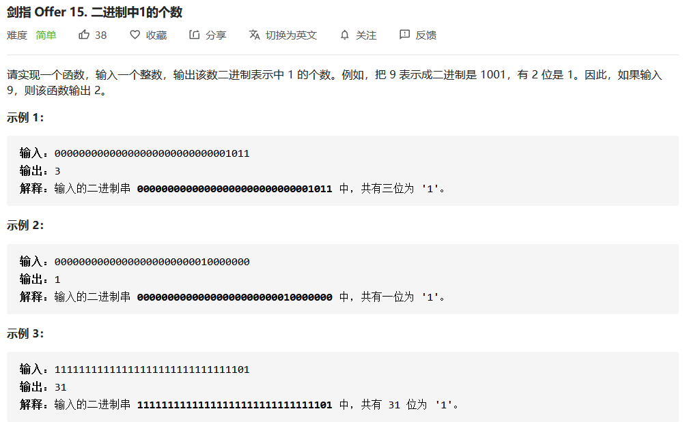
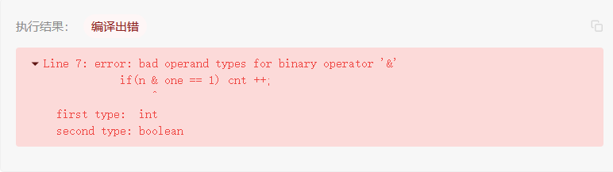
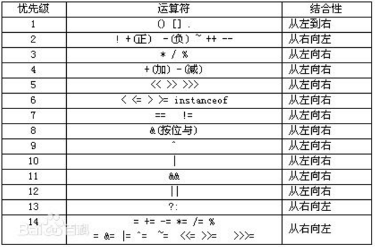

今天在刷LeetCode时，代码爆了'error: bad operand types for binary operator &'错误

<!--more-->

原题目和代码都贴出来



```java
public class Solution {
    // you need to treat n as an unsigned value
    public int hammingWeight(int n) {
        int cnt = 0;
        int one = 1;
        while(n != 0) {
            if(n & one == 1) cnt ++;

            n >>>= 1;
        }
        return cnt;
    }
}
```

运行的时候编译出错




错误提示&符号前面是int后面是boolean，我就奇怪了哪来的boolean

原来是&和==的运算优先级问题，因为后者的优先级大于前者，所以代码应改为

```java
public class Solution {
    // you need to treat n as an unsigned value
    public int hammingWeight(int n) {
        int cnt = 0;
        int one = 1;
        while(n != 0) {
            if((n & one) == 1) cnt ++;//这里进行了修改

            n >>>= 1;
        }
        return cnt;
    }
}
```

最后附一张运算优先级的表格

