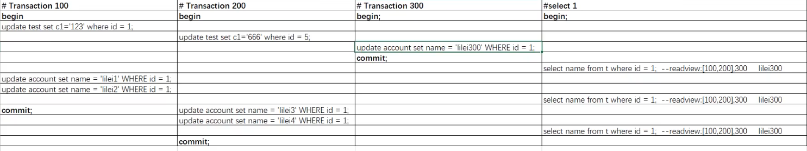
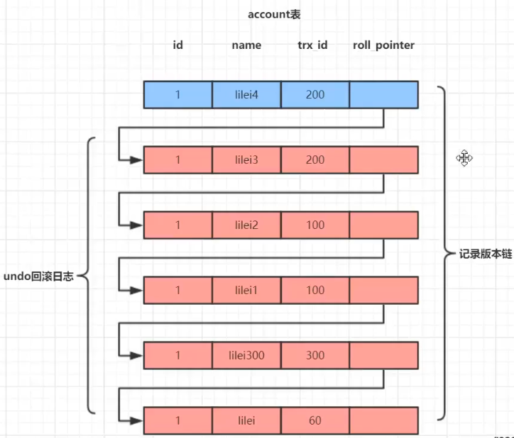
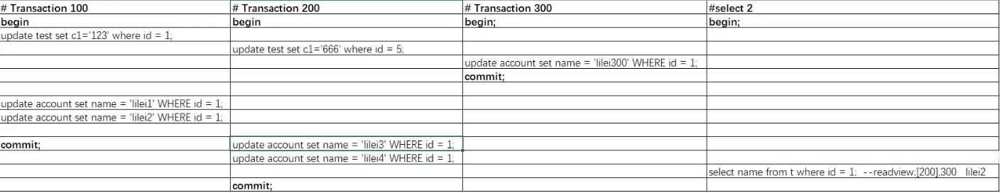

在SQL标准中，RR是无法避免幻读问题的，但是InnoDB实现的RR避免了幻读，但是RC无法避免不可重复读、幻读问题

**隔离性的实现：写和写之间的隔离性通过加锁，包括行锁表锁。读和写之间的隔离性通过MVCC实现。而读分为加锁读（当前读）和非加锁读（快照读）。快照读使用普通的select语句，这种情况下使用MVCC避免了脏读、不可重复读、幻读，保证了隔离性。当前读由于锁的特性，当某事务对数据进行加锁读后，其他事务无法对数据进行写操作，因此可以避免脏读和不可重复读。而避免幻读，则需要通过next-key lock，同样可以避免脏读、不可重复读和幻读，保证隔离性。**

MVCC最大的优点是读不加锁，因此读写不冲突，并发性能好


按照是否加锁，MySQL的读可以分为两种：

一种是非加锁读，也称作快照读、一致性读，使用普通的select语句，这种情况下使用MVCC避免了脏读、不可重复读、幻读，保证了隔离性。

另一种是加锁读

```
#共享锁读取
select...lock in share mode
#排它锁读取
select...for update
```

加锁读在查询时会对查询的数据加锁（共享锁或排它锁）。由于锁的特性，当某事务对数据进行加锁读后，其他事务无法对数据进行写操作，因此可以避免脏读和不可重复读。而避免幻读，则需要通过next-key lock。next-key lock是行锁的一种，实现相当于record lock(记录锁) + gap lock(间隙锁）；其特点是不仅会锁住记录本身(record lock的功能)，还会锁定一个范围(gap lock的功能)。因此，加锁读同样可以避免脏读、不可重复读和幻读，保证隔离性

<!--more-->

下面的每个Transaction的序号是从小到大生成的，现在有三个事务，小于100的事务全部已经提交，100-300为未提交事务一直到已创建的最大事务，300以上还没创建所以是未开始事务

min_id=100,max_id=300

read-view:[100,200],300




事务100执行set c1 = '123'会生成一个新记录，让旧记录放在undo回滚日志里，按时间顺序新记录和旧记录形成版本链，蓝色为当前最新的记录



使用上面的read-view[100,200],300得到name查询结果

查询过程为Select快照读去读取版本链，拿每个版本的事务id和read-view去比较

trx_id<100的为已提交事务，是结果可见的

100<=trx_id<=300分为两种情况：一是trx_id在未提交数组中，则事务未提交，仅那个修改的事务可见，其他不可见。二是不在数组中，则事务已提交，结果可见

trx_id>300表示这个版本是生成了raed-view后未来生成的版本，自己是不可见的

**在RC隔离级别下，是每个SELECT都会获取最新的read view；而在RR隔离级别下，则是当事务中的第一个SELECT请求才创建read view。**

这里是在RR隔离级别下

**session1在select的时候就生成了一份read-view，之后就不变了，因为要保证可重复读，然后根据这个read-view查询当前版本链（版本链只有一份，是会随时间变化的）**

**图中session1的三次查询都为lilei300，因为要保证可重复读**




**session2在select的时候生成一份read-view[200],300，因为100是<200的且已提交，300是从200一直到最大已创建事务，所以commit了也算进去**

**根据这个read-view查，从上到下，因为200在未提交数组中，所以结果不可见，一直到100，100<最小值200，所以结果可见，结果为lilei2**

