# 基础能力建设

## 项目创建

项目的创建通过了Spring Boot项目的快速创建方式，从Spring官网选择Starter进行创建

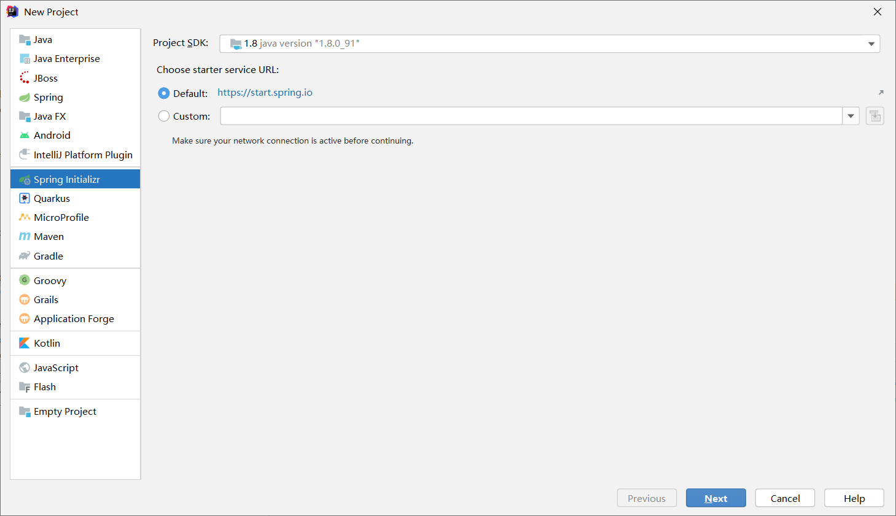

<!--more-->

选中Web模块直接创建，查看pom文件

```xml
<!--指定项目的父pom文件为spring-boot-starter-parent-->    
<parent>
    <groupId>org.springframework.boot</groupId>
    <artifactId>spring-boot-starter-parent</artifactId>
    <version>2.3.2.RELEASE</version>
    <relativePath/> <!-- lookup parent from repository -->
</parent>
```

### 引入依赖包

```xml
<!-- mybatis启动器 -->
<dependency>
    <groupId>org.mybatis.spring.boot</groupId>
    <artifactId>mybatis-spring-boot-starter</artifactId>
    <version>2.1.3</version>
</dependency>
<!-- mysql 版本要与本机安装的版本一致 -->
<dependency>
    <groupId>mysql</groupId>
    <artifactId>mysql-connector-java</artifactId>
    <version>8.0.20</version>
</dependency>
<!-- 德鲁伊数据库连接池 -->
<dependency>
    <groupId>com.alibaba</groupId>
    <artifactId>druid</artifactId>
    <version>1.1.20</version>
</dependency>
```

在application.properties里配置mybatis的mapperLocation，为接下来的mybatis-generator自动生成mapper后指定mapper.xml的路径，**mybatis.mapper-locations在SpringBoot配置文件中使用，作用是扫描Mapper接口对应的XML文件，如果全程使用@Mapper注解代替Mapper.xml文件，可以不使用该配置。**

@Mapper/@MapperScan和 mapper-locations的区别见这里https://blog.csdn.net/weixin_43963583/article/details/105653333?utm_medium=distribute.pc_relevant_t0.none-task-blog-BlogCommendFromMachineLearnPai2-1.channel_param&depth_1-utm_source=distribute.pc_relevant_t0.none-task-blog-BlogCommendFromMachineLearnPai2-1.channel_param

```properties
mybatis.mapper-locations=classpath:mapping/*.xml
```

## Mybatis自动生成器

### 创建数据库

#### 创建用户表

创建数据库seckill并且创建用户表user_info

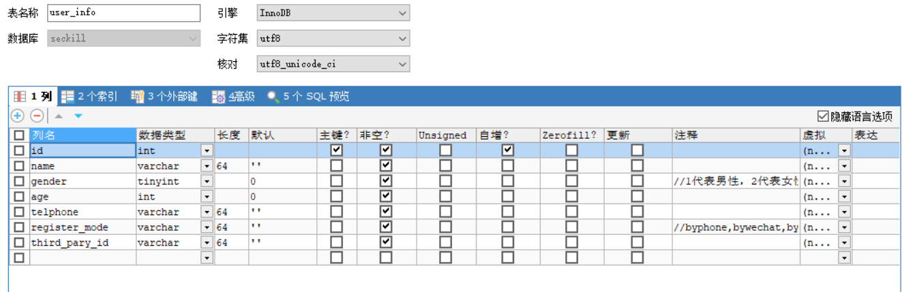

gender的数据类型可以为int，设置为tinyint是出于性能考虑

register_mode注册方式，有三种注册方式：byphone通过手机号、bywechat通过微信、byalipay通过支付宝

third_party_id第三方登录的id，系统默认是通过手机号登录，如果通过微信或者支付宝登录则在这里记录微信支付宝的id，如果这个值为空则通过手机号telphone做一个otp校验码注册后再登录

#### 创建用户密码表

user的password是加密的字符串，一般不跟主表放在一起，企业开发里放在另一台系统上进行，这里为了简单起见不去模拟几台机器的操作，而是至少在数据库层面密码和用户主表是分开存储的

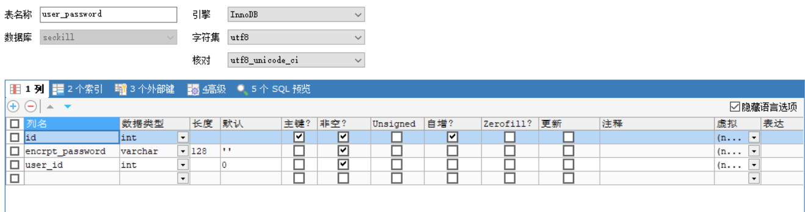

encrpt_passoword，密码会经过encrpt的加密方式，以密文方式存在数据库中

user_id是一个外键，用于关联到用户主表

### 导入Mybatis自动生成插件

在pom.xml中导入mybatis-generator-maven-plugin插件

```xml
<!--自动生成文件插件,mybatis generator-->
<plugin>
    <groupId>org.mybatis.generator</groupId>
    <artifactId>mybatis-generator-maven-plugin</artifactId>
    <version>1.3.5</version>

    <!--插件的依赖-->
    <dependencies>
        <dependency>
            <groupId>org.mybatis.generator</groupId>
            <artifactId>mybatis-generator-core</artifactId>
            <version>1.3.5</version>
        </dependency>
        <dependency>
            <groupId>mysql</groupId>
            <artifactId>mysql-connector-java</artifactId>
            <version>8.0.20</version>
        </dependency>
    </dependencies>

    <executions>
        <execution>
            <id>mybatis generator</id>
            <phase>package</phase>
            <goals>
                <goal>generate</goal>
            </goals>
        </execution>
    </executions>

    <configuration>
        <!--允许移动生成的文件-->
        <verbose>true</verbose>
        <!--允许自动覆盖文件，这里设置为false，重新运行generator之后不会覆盖之前的Mapper等文件-->
        <overwrite>true</overwrite>
        <!--配置文件路径-->
        <configurationFile>
            src/main/resources/mybatis-generator.xml
        </configurationFile>
    </configuration>
</plugin>
```

### Mybatis自动生成器配置文件

mybatis-generator.xml可以从官网上下载，网上其他地方也有很多，这里附上[官网下载地址](http://mybatis.org/generator/configreference/xmlconfig.html)

mybatis-generator.xml的内容如下

```xml
<?xml version="1.0" encoding="UTF-8"?>
<!DOCTYPE generatorConfiguration
        PUBLIC "-//mybatis.org//DTD MyBatis Generator Configuration 1.0//EN"
        "http://mybatis.org/dtd/mybatis-generator-config_1_0.dtd">

<generatorConfiguration>

    <context id="DB2Tables" targetRuntime="MyBatis3">
        <!--数据库连接地址账号密码-->
        <jdbcConnection driverClass="com.mysql.jdbc.Driver"
                        connectionURL="jdbc:mysql://127.0.0.1:3306/seckill"
                        userId="root"
                        password="root">
        </jdbcConnection>


        <!--生成Model/DataObject类存放的位置，数据库到Java类-->
        <javaModelGenerator targetPackage="com.seckillproject.dataobject" targetProject="src/main/java">
            <property name="enableSubPackages" value="true" />
            <property name="trimStrings" value="true" />
        </javaModelGenerator>

        <!--生成映射文件存放的位置-->
        <sqlMapGenerator targetPackage="mapping"  targetProject="src/main/resources">
            <property name="enableSubPackages" value="true" />
        </sqlMapGenerator>

        <!--生成Dao类存放的位置-->
        <javaClientGenerator type="XMLMAPPER" targetPackage="com.seckillproject.dao"  targetProject="src/main/java">
            <property name="enableSubPackages" value="true" />
        </javaClientGenerator>

        <!--生成对应表及类名-->
        <table tableName="user_info" domainObjectName="UserDO"></table>
        <table tableName="user_password" domainObjectName="UserPasswordDO"></table>
    </context>
</generatorConfiguration>
```

修改其中的配置，在Run-Edit Configurations里新建maven命令，在Command line里添加

```
mybatis-generator:generate
```

上面这行命令就会解析项目文件里指定的mybatis-generator插件，并且执行它

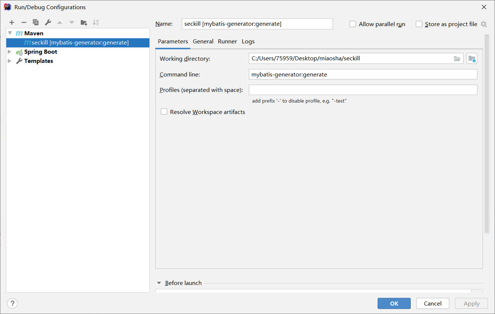

添加命令后Run项目会生成一些文件，文件目录的配置都在mybatis-generator.xml中

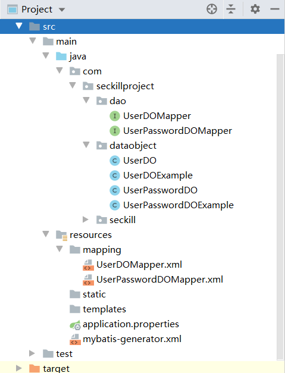

#### UserDoMapper.xml

打开UserDoMapper.xml

```xml
<sql id="Example_Where_Clause">
<!--
  WARNING - @mbg.generated
  This element is automatically generated by MyBatis Generator, do not modify.
  This element was generated on Sat Aug 01 19:56:02 CST 2020.
-->
<where>
  <foreach collection="oredCriteria" item="criteria" separator="or">
    <if test="criteria.valid">
      <trim prefix="(" prefixOverrides="and" suffix=")">
        <foreach collection="criteria.criteria" item="criterion">
          <choose>
            <when test="criterion.noValue">
              and ${criterion.condition}
            </when>
            <when test="criterion.singleValue">
              and ${criterion.condition} #{criterion.value}
            </when>
            <when test="criterion.betweenValue">
              and ${criterion.condition} #{criterion.value} and #{criterion.secondValue}
            </when>
            <when test="criterion.listValue">
              and ${criterion.condition}
              <foreach close=")" collection="criterion.value" item="listItem" open="(" separator=",">
                #{listItem}
              </foreach>
            </when>
          </choose>
        </foreach>
      </trim>
    </if>
  </foreach>
</where>
</sql>
```

可以看到里面有自动生成的复杂查询语句，通过在mybatis-generator.xml中配置可以避免，只生成简单查询语句

```xml
<!--生成对应表及类名-->
<table tableName="user_info" domainObjectName="UserDO" enableCountByExample="false" enableUpdateByExample="false" enableDeleteByExample="false" enableSelectByExample="false" selectByExampleQueryId="false"></table>
<table tableName="user_password" domainObjectName="UserPasswordDO" enableCountByExample="false" enableUpdateByExample="false" enableDeleteByExample="false" enableSelectByExample="false" selectByExampleQueryId="false"></table>
```

#### UserDOExample

```java
public class UserDOExample {
    /**
     * This field was generated by MyBatis Generator.
     * This field corresponds to the database table user_info
     *
     * @mbg.generated Sat Aug 01 19:56:02 CST 2020
     */
    protected String orderByClause;

    /**
     * This field was generated by MyBatis Generator.
     * This field corresponds to the database table user_info
     *
     * @mbg.generated Sat Aug 01 19:56:02 CST 2020
     */
    protected boolean distinct;

    /**
     * This field was generated by MyBatis Generator.
     * This field corresponds to the database table user_info
     *
     * @mbg.generated Sat Aug 01 19:56:02 CST 2020
     */
    protected List<Criteria> oredCriteria;
```

UserDOExample是自动生成器帮我们自动生成的用于复杂查询的类，复杂查询一般自己编写，不会使用它生成的这个，所以直接删除它，删除后的结构如下

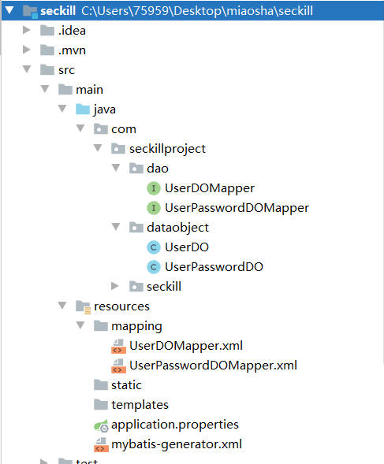

#### 遇到的问题

运行的时候报错

The server time zone value '?й???????' is unrecognized or represents more than one time zone

原因是数据库的时区不正确

**解决方案：**

1.在项目代码-数据库连接URL后，加上 ?serverTimezone=UTC

2.在mysql中设置时区，默认为SYSTEM
set global time_zone=’+8:00’

```sql
mysql> set global time_zone='+8:00';
Query OK, 0 rows affected (0.01 sec)
```

## 接入数据源

Mybatis是ORM层框架，对应MySQL数据库要有一个数据源

### 数据源作用

数据源建立多个数据库连接，这些数据库连接会保存在数据库连接池中

当需要访问数据库时，只需要从数据库连接池中，获取空闲的数据库连接

当程序访问数据库结束时，数据库连接会放回数据库连接池中

### 数据源配置

在application.properties中配置

```properties
spring.datasource.name=seckill
spring.datasource.url=jdbc:mysql://127.0.0.1:3306/seckill
spring.datasource.username=root
spring.datasource.password=root

#使用druid数据源
spring.datasource.type=com.alibaba.druid.pool.DruidDataSource
spring.datasource.driver-class-name=com.mysql.jdbc.Driver
```

### 主配置类的更改

主配置类指定@SpringBootApplication(scanBasePackages)和@MapperScan，这里配置的scanBasePackages其实还没有用到，主要是和@Controller、@Service、@Component、@Repository配合用

```java
package com.seckillproject.seckill;

import org.mybatis.spring.annotation.MapperScan;
import org.springframework.boot.SpringApplication;
import org.springframework.boot.autoconfigure.SpringBootApplication;
import org.springframework.context.annotation.ComponentScan;

@SpringBootApplication(scanBasePackages = {"com.seckillproject"})
@MapperScan("com.seckillproject.dao")
public class SeckillApplication {


    public static void main(String[] args) {
        SpringApplication.run(SeckillApplication.class, args);
    }

}
```

#### @SpringBootApplication(scanBasePackages)

@SpringBootApplication是一个复合注解，包含了@SpringBootConfiguration，@EnableAutoConfiguration和@ComponentScan三个注解，scanBasePackages是@ComponentScan的属性，作用是扫描指定包下所有的组件，放入容器

#### @MapperScan和@Mapper

@Mapper注解：
	作用：在接口类上添加了@Mapper，在编译之后会生成相应的接口实现类

​	添加位置：Dao层的接口类上面

@MapperScan
	 作用：指定要变成实现类的接口所在的包，然后包下面的所有接口在编译之后都会生成相应的实现类

 	添加位置：是在Springboot启动类上面添加

mybatis支持的映射方式有基于xml的mapper.xml文件，和基于注解的@Insert、@Update、@Delete

两者都需要使用@Mapper或者@MapperScan

## 完整SpringMVC 查询用户信息

### service层

service层下有UserService接口

```java
package com.seckillproject.service;

public interface UserService {
    //通过用户ID获取用户对象的方法
    void getUserById(Integer id);
}
```

还有Implement包，impl包下有UserServiceImpl实现类

```java
package com.seckillproject.service.impl;

import com.seckillproject.dao.UserDOMapper;
import com.seckillproject.dataobject.UserDO;
import com.seckillproject.service.UserService;
import org.springframework.beans.factory.annotation.Autowired;
import org.springframework.stereotype.Service;

@Service
public class UserServiceImpl implements UserService {

    @Autowired
    private UserDOMapper userDOMapper;
    @Override
    public void getUserById(Integer id) {
        UserDO userDO = userDOMapper.selectByPrimaryKey(id);
    }
}

```

#### model层

##### UserModel类

因为企业级开发里是不能从Service层里传出UserDo对象的，所以还需要在Service里加一个model包，用来定义业务逻辑交互，实现UserModel

```java
package com.seckillproject.service.model;

public class UserModel {
    private Integer id;
    private String name;
    private Byte gender;
    private String age;
    private String telphone;
    private String registerMode;
    private String thirdPartyId;

    private String encrptPassword;

    public String getEncrptPassword() {
        return encrptPassword;
    }

    public void setEncrptPassword(String encrptPassword) {
        this.encrptPassword = encrptPassword;
    }

    public Integer getId() {
        return id;
    }

    public void setId(Integer id) {
        this.id = id;
    }

    public String getName() {
        return name;
    }

    public void setName(String name) {
        this.name = name;
    }

    public Byte getGender() {
        return gender;
    }

    public void setGender(Byte gender) {
        this.gender = gender;
    }

    public String getAge() {
        return age;
    }

    public void setAge(String age) {
        this.age = age;
    }

    public String getTelphone() {
        return telphone;
    }

    public void setTelphone(String telphone) {
        this.telphone = telphone;
    }

    public String getRegisterMode() {
        return registerMode;
    }

    public void setRegisterMode(String registerMode) {
        this.registerMode = registerMode;
    }

    public String getThirdPartyId() {
        return thirdPartyId;
    }

    public void setThirdPartyId(String thirdPartyId) {
        this.thirdPartyId = thirdPartyId;
    }
}

```

encrptPassword是属于用户对象的，仅仅是因为数据模型层的关系，把它和用户主表设计成两个表，但是对对象来说就是属于UserModel的

UserModel才是真正意义上处理业务逻辑的模型，DataObject仅仅是一个数据库的映射

##### convertFromDataObject

在UserServiceImpl中增加convertFromDataObject，用来使用UserDO和UserPasswordDO去构造返回的UserModel

```java
private UserModel convertFromDataObject(UserDO userDO, UserPasswordDO userPasswordDO) {
    if (userDO == null) {
        return null;
    }
    UserModel userModel = new UserModel();
    //copyProperties要求两个对象的要赋值的字段，类型和名称都要相同
    BeanUtils.copyProperties(userDO,userModel);

    //不能用copyProperties去设置password，因为有一个id字段是重复的
    if(userPasswordDO != null) {
        userModel.setEncrptPassword(userPasswordDO.getEncrptPassword());
    }
    return userModel;
}
```

##### getUserById

要实现getUserById方法，需要引入userPasswordDOMapper

```java
@Autowired
private UserPasswordDOMapper userPasswordDOMapper;
```

但是自动生成器仅仅帮我们实现了selectByPrimaryKey，我们需要根据用户id查找他的password

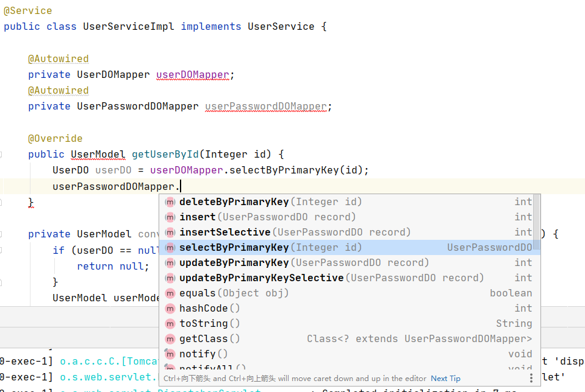

所以在UserPasswordDOMapper.xml下增加SQL语句

```xml
<select id="selectByUserId" parameterType="java.lang.Integer" resultMap="BaseResultMap">
select
<include refid="Base_Column_List" />
from user_password
where user_id = #{userId,jdbcType=INTEGER}
</select>
```

在UserPasswordDOMapper接口中增加实现

```java
UserPasswordDO selectByUserId(Integer id);
```

最后完成UserServiceImpl的getUserById

```java
public UserModel getUserById(Integer id) {
    //调用userDOMapper获取到对应用户的dataobject
    UserDO userDO = userDOMapper.selectByPrimaryKey(id);

    if(userDO == null) {
        return null;
    }
    //通过用户Id获取对应的用户加密密码信息
    UserPasswordDO userPasswordDO = userPasswordDOMapper.selectByUserId(userDO.getId());
    return convertFromDataObject(userDO,userPasswordDO);
}
```

### controller层

创建Controller包下的UserController

```java
package com.seckillproject.controller;

import com.seckillproject.service.UserService;
import com.seckillproject.service.model.UserModel;
import org.springframework.beans.factory.annotation.Autowired;
import org.springframework.stereotype.Controller;
import org.springframework.web.bind.annotation.RequestMapping;
import org.springframework.web.bind.annotation.RequestParam;
import org.springframework.web.bind.annotation.ResponseBody;

@Controller("user")
@RequestMapping("/user")
public class UserController {

    @Autowired
    private UserService userService;

    @RequestMapping("/get")
    @ResponseBody
    public UserModel getUser(@RequestParam(name="id") Integer id) {
        //调用service服务器获取对应id的用户对象并返回给前端
        UserModel userModel = userService.getUserById(id);
        return userModel;
    }
}

```

#### 测试结果

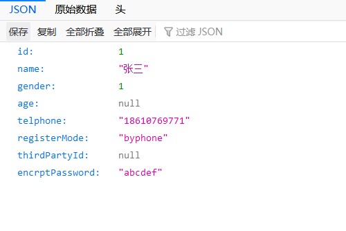

结果发现用户经过加密的密码也会展示出来，问题出在Service层返回了完整的UserModel，Controller层返回了反正的UserModel，只需要让Controller返回前端需要展示的数据即可

因此在Controller里加一层ViewObject

#### viewobject层

ViewObject里创建UserVO

```java
package com.seckillproject.controller.viewobject;

public class UserVO {
    private Integer id;
    private String name;
    private Byte gender;
    private String age;
    private String telphone;

    public Integer getId() {
        return id;
    }

    public void setId(Integer id) {
        this.id = id;
    }

    public String getName() {
        return name;
    }

    public void setName(String name) {
        this.name = name;
    }

    public Byte getGender() {
        return gender;
    }

    public void setGender(Byte gender) {
        this.gender = gender;
    }

    public String getAge() {
        return age;
    }

    public void setAge(String age) {
        this.age = age;
    }

    public String getTelphone() {
        return telphone;
    }

    public void setTelphone(String telphone) {
        this.telphone = telphone;
    }
}
```

UserVO里封装只想让前端展示的数据

和UserModel一样将UserController增加convertFromUserModel方法

```java
private UserVO convertFromUserModel(UserModel userModel) {
    if(userModel == null) {
        return null;
    }
    UserVO userVO = new UserVO();
    BeanUtils.copyProperties(userModel,userVO);
    return userVO;
}
```

将getUser返回UserModel改为返回UserVO

```java
@RequestMapping("/get")
@ResponseBody
public UserVO getUser(@RequestParam(name="id") Integer id) {
    //调用service服务器获取对应id的用户对象并返回给前端
    UserModel userModel = userService.getUserById(id);

    //将核心领域模型用户对象转化为可提供UI使用的viewObject
    return convertFromUserModel(userModel);
}
```

经过再次测试结果如下，没有返回密码等不应该返回的数据

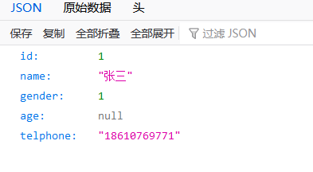

### 总结

至此做了完整的读操作展示，从Controller层到Service层到DataObject层，DataObject层负责数据存储和到Service的传输，在Service层组装了需要的一个核心领域模型做下一步的处理，Controller层做了ViewObject，保证了UI只使用到它需要展示的字段

## 定义通用的返回对象

项目中如果出现了异常，异常会抛到Tomcat容器层中，Tomcat帮我们处理，前端会出现自带的Error Page，我们需要将成功和异常统一起来

### response层

创建response包，用来处理HTTP返回

新建CommonReturnType类

```java
package com.seckillproject.response;

public class CommonReturnType {

    //表明对应请求的返回处理"success"或者"fail"
    private String status;
    //若status="success",data返回前端需要数据
    //若Status="fail",data使用通用的错误码格式
    private Object data;

    //定义一个通用的创建方法
    public static CommonReturnType create(Object result) {
        return CommonReturnType.create(result,"success");
    }
    public static CommonReturnType create(Object result,String status) {
        CommonReturnType type = new CommonReturnType();
        type.setData(result);
        type.setStatus(status);
        return type;
    }

    public String getStatus() {
        return status;
    }

    public void setStatus(String status) {
        this.status = status;
    }

    public Object getData() {
        return data;
    }

    public void setData(Object data) {
        this.data = data;
    }
}
```

UserController的getUser方法也要更改，返回通用对象

```java
    @RequestMapping("/get")
    @ResponseBody
    public CommonReturnType getUser(@RequestParam(name="id") Integer id) {
        //调用service服务器获取对应id的用户对象并返回给前端
        UserModel userModel = userService.getUserById(id);

        //将核心领域模型用户对象转化为可提供UI使用的viewObject
        UserVO userVO =  convertFromUserModel(userModel);
        //返回通用对象
        return CommonReturnType.create(userVO);
    }
```

测试发现返回了通用对象

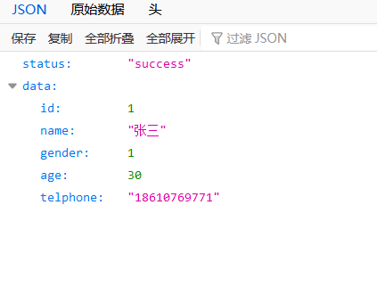

### error层

#### CommonError接口

项目下创建error层，创建CommonError接口

```java
package com.seckillproject.error;

public interface CommonError {
    public int getErrCode();
    public String getErrMsg();

    public CommonError setErrMsg(String errMsg);
}
```

#### EmBusinessError类

创建枚举类型的EmBusinessError去实现CommonError接口

定义一个简单的错误码USER_NOT_EXIST，值为10001。一般企业开发需要一个统一的全局错误码，所以让10000开头为用户信息相关错误定义。

定义了通用错误类型，比如值为00001，含义参数不合法。这样可以省去很多地方都定义错误类型，比如传入方法里邮箱不合法、手机号不合法等等，都使用通用错误类型。它们的errCode虽然是一样的，但是errMsg却根据场景不同要有变化，所以接口中定义的public CommonError setErrMsg(String errMsg);就是为了改变不同场景下的errMsg

```java
package com.seckillproject.error;

public enum EmBusinessError implements CommonError{
    //通用错误类型00001
    PARAMETER_VALIDATION_ERROR(00001,"参数不合法"),

    //10000开头为用户信息相关错误定义
    USER_NOT_EXIST(10001,"用户不存在")
    ;
    private int errCode;
    private String errMsg;

    private EmBusinessError(int errCode,String errMsg) {
        this.errCode = errCode;
        this.errMsg = errMsg;
    }
    @Override
    public int getErrCode() {
        return this.errCode;
    }

    @Override
    public String getErrMsg() {
        return this.errMsg;
    }

    @Override
    public CommonError setErrMsg(String errMsg) {
        this.errMsg = errMsg;
        return this;
    }
}
```

#### BusinessException类

一般程序出了异常，统一抛出Exception，直到Controller层的SpringBootHandler捕获处理

创建BusinessException类

```java
package com.seckillproject.error;

//包装器业务异常类实现
public class BusinessException extends Exception implements CommonError{
    private CommonError commonError;

    //直接接收EmBusinessError的传参用于构造业务异常
    public BusinessException(CommonError commonError) {
        super();
        this.commonError = commonError;
    }

    //接收自定义errMsg的方式构造业务异常
    public BusinessException(CommonError commonError,String errMsg) {
        super();
        this.commonError = commonError;
        this.commonError.setErrMsg(errMsg);
    }

    @Override
    public int getErrCode() {
        return this.commonError.getErrCode();
    }

    @Override
    public String getErrMsg() {
        return this.commonError.getErrMsg();
    }

    @Override
    public CommonError setErrMsg(String errMsg) {
        this.commonError.setErrMsg(errMsg);
        return this;
    }
}
```

BusinessException和EmBusinessError枚举类都实现了CommonError接口，以至于外部可以通过new EmBusinessError和new BusinessException都可以由errCode和errMsg的组装定义，这两个类都要实现setErrMsg方法，将原本的errMsg给覆盖掉

### controller层

#### exceptionHandler

对于Web系统来说e，Controller层是业务处理的最后一道关口，如果Controller层不处理异常，抛给Tomcat，就会出现自带的Error Page页，所以需要我们在Controller统一处理

在Controller层写handlerException方法

```java
//定义exceptionhandler解决未被controller层吸收的exception
@ExceptionHandler(Exception.class)
@ResponseStatus(HttpStatus.OK)
@ResponseBody//不加ResponseBody就会返回链接地址，而不是对象
public Object handlerException(HttpServletRequest httpServletRequest,Exception exception) {
    CommonReturnType commonReturnType = new CommonReturnType();
    commonReturnType.setStatus("fail");
    commonReturnType.setData(exception);
    return commonReturnType;
}
```

使用@ExceptionHandler指明处理的是哪个异常，@ResponseStatus指明方法返回的是什么HttpStatus，返回OK不会出现自带错误页面

运行项目，输入http://localhost:8080/user/get?id=2，返回了通用返回对象

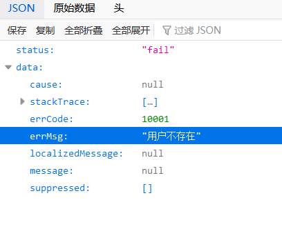

但是这些返回的Json里面还有我们不需要的东西，对handlerException的代码进一步改造

```java
@ExceptionHandler(Exception.class)
@ResponseStatus(HttpStatus.OK)
@ResponseBody
public Object handlerException(HttpServletRequest httpServletRequest,Exception exception) {
    BusinessException businessException = (BusinessException)exception;

    Map<String,Object> responseData = new HashMap<>();
    responseData.put("errCode",businessException.getErrCode());
    responseData.put("errMsg",businessException.getErrMsg());
    return CommonReturnType.create(responseData,"fail");
}
```

再次运行测试，输入http://localhost:8080/user/get?id=2

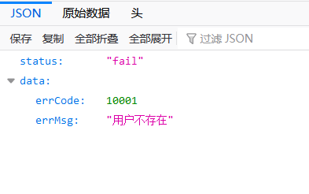

可以看到只返回了我们需要的字段，即status为fail的时候，返回的data为errCode+errMsg的类型

如果传过来的exception不是BusinessException的类型，需要定义一个新的类型错误，未知错误

```java
//通用错误类型10001
PARAMETER_VALIDATION_ERROR(10001,"参数不合法"),
UNKNOWN_ERROR(10002,"未知错误"),
//20000开头为用户信息相关错误定义
USER_NOT_EXIST(20001,"用户不存在")
;
```

这里本来是下面这样的

```java
//通用错误类型00001
PARAMETER_VALIDATION_ERROR(00001,"参数不合法"),
UNKNOWN_ERROR(00002,"未知错误"),
//10000开头为用户信息相关错误定义
USER_NOT_EXIST(10001,"用户不存在")
;
```

但是int 类型的00002传到前端转成Json格式就变成了2

#### BaseController

这里Controller层的代码如下

```java
package com.seckillproject.controller;

import com.seckillproject.controller.viewobject.UserVO;
import com.seckillproject.error.BusinessException;
import com.seckillproject.error.EmBusinessError;
import com.seckillproject.response.CommonReturnType;
import com.seckillproject.service.UserService;
import com.seckillproject.service.model.UserModel;
import org.springframework.beans.BeanUtils;
import org.springframework.beans.factory.annotation.Autowired;
import org.springframework.http.HttpStatus;
import org.springframework.stereotype.Controller;
import org.springframework.web.bind.annotation.*;

import javax.servlet.http.HttpServletRequest;
import java.util.HashMap;
import java.util.Map;

@Controller("user")
@RequestMapping("/user")
public class UserController {

    @Autowired
    private UserService userService;

    @RequestMapping("/get")
    @ResponseBody
    public CommonReturnType getUser(@RequestParam(name="id") Integer id) throws BusinessException {
        //调用service服务器获取对应id的用户对象并返回给前端
        UserModel userModel = userService.getUserById(id);
        //若获取的用户信息不存在
        if(userModel == null){
            throw new BusinessException(EmBusinessError.USER_NOT_EXIST);
        }

        //将核心领域模型用户对象转化为可提供UI使用的viewObject
        UserVO userVO =  convertFromUserModel(userModel);
        //返回通用对象
        return CommonReturnType.create(userVO);
    }

    private UserVO convertFromUserModel(UserModel userModel) {
        if(userModel == null) {
            return null;
        }
        UserVO userVO = new UserVO();
        BeanUtils.copyProperties(userModel,userVO);
        return userVO;
    }

    //定义exceptionhandler解决未被controller层吸收的exception
    @ExceptionHandler(Exception.class)
    @ResponseStatus(HttpStatus.OK)
    @ResponseBody
    public Object handlerException(HttpServletRequest httpServletRequest,Exception exception) {
        Map<String,Object> responseData = new HashMap<>();
        if(exception instanceof BusinessException) {
            BusinessException businessException = (BusinessException)exception;
            responseData.put("errCode",businessException.getErrCode());
            responseData.put("errMsg",businessException.getErrMsg());
        } else {
            responseData.put("errCode",EmBusinessError.UNKNOWN_ERROR.getErrCode());
            responseData.put("errMsg",EmBusinessError.UNKNOWN_ERROR.getErrMsg());
        }
        return CommonReturnType.create(responseData,"fail");
    }
}
```

在这里异常处理类定义在了UserController里，但其实handlerException是所有controller公用的逻辑

所以抽象一层BaseController层，将异常处理放在基类里

```java
package com.seckillproject.controller;

import com.seckillproject.error.BusinessException;
import com.seckillproject.error.EmBusinessError;
import com.seckillproject.response.CommonReturnType;
import org.springframework.http.HttpStatus;
import org.springframework.web.bind.annotation.ExceptionHandler;
import org.springframework.web.bind.annotation.ResponseBody;
import org.springframework.web.bind.annotation.ResponseStatus;

import javax.servlet.http.HttpServletRequest;
import java.util.HashMap;
import java.util.Map;

public class BaseController {

    //定义exceptionhandler解决未被controller层吸收的exception
    @ExceptionHandler(Exception.class)
    @ResponseStatus(HttpStatus.OK)
    @ResponseBody
    public Object handlerException(HttpServletRequest httpServletRequest, Exception exception) {
        Map<String,Object> responseData = new HashMap<>();
        if(exception instanceof BusinessException) {
            BusinessException businessException = (BusinessException)exception;
            responseData.put("errCode",businessException.getErrCode());
            responseData.put("errMsg",businessException.getErrMsg());
        } else {
            responseData.put("errCode", EmBusinessError.UNKNOWN_ERROR.getErrCode());
            responseData.put("errMsg",EmBusinessError.UNKNOWN_ERROR.getErrMsg());
        }
        return CommonReturnType.create(responseData,"fail");
    }
}
```

同时让UserController去继承BaseController

这样UserController抛出的异常就能由BaseController内的handlerException处理，因为handlerException方法也得到了继承

运行测试，http://localhost:8080/user/get?id=2

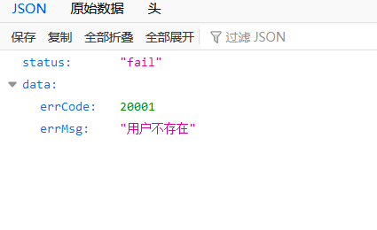

可以看到异常被正确的处理了，注意这里errCode已经改成了最新的

### 总结

定义了CommonReturnType，能够用对应的String status和Object data返回所有的Json序列化的一个固定对象，供前端解析使用，摒弃了HttpStatusCode+内嵌Tomcat自带的ErrorPage页的方式处理异常

定义了一个Common的BussinessError的方式，去统一管理我们所需要的错误码

在BaseController基类里，定义了一个通用的exceptionhandler解决未被controller层吸收的exception。并且使用errorCode+errorMsg的统一定义方式吃掉了所有内部未知的异常

## 基础能力总结

到目前位置完成了SpringBoot+Mybatis+SpringMVC框架+常态的错误定义等基础能力

# 模型能力管理

模型管理就是去完成领域模型，会有用户模型商品模型下单模型

## 用户模型管理

### otp短信获取

#### 用户获取otp短信接口

在UserController中加入getOtp方法作为用户获取otp短信的接口

```java
@Autowired
private HttpServletRequest httpServletRequest;
//用户获取otp短信接口
@RequestMapping("/getotp")
@ResponseBody
public CommonReturnType getOtp(@RequestParam(name="telphone") String telphone) {
    //需要按照一定规则生成OTP验证码
    Random random = new Random();
    int randomInt = random.nextInt(99999);
    randomInt += 10000;
    String otpCode = String.valueOf(randomInt);

    //将OTP验证码同对应用户的手机号关联，使用httpsession的方式绑定他的手机号与OTPCODE
    httpServletRequest.getSession().setAttribute(telphone,otpCode);

    //将OTP验证码通过短信通道发送给用户，这里省略
    System.out.println("telphone=" + telphone + "otpCode=" + otpCode);
    return CommonReturnType.create(null);
}
```

将OTP验证码同对应用户手机号关联最好使用key-value对的形式，企业采用Redis的去存储，因为Redis天然支持key-value对的形式，可以设置生存时间，也可以反复点击覆盖，但是这里没讲到Redis，先用httpsession绑定手机号和otpcode

HttpServletRequest是通过容器注入的，HttpServletRequest是一个单例的模式，怎么能支持多个用户的并发访问？

通过Bean包装的HttpServletRequest内部拥有ThreadLocalMap，能让不同用户在自己的线程中处理自己的request，并且有ThreadLocal清除机制

#### otp注册用户

接下来做用户注册的界面，下载的Static静态资源包里的内容是基于BootStrap的Metronic框架模板

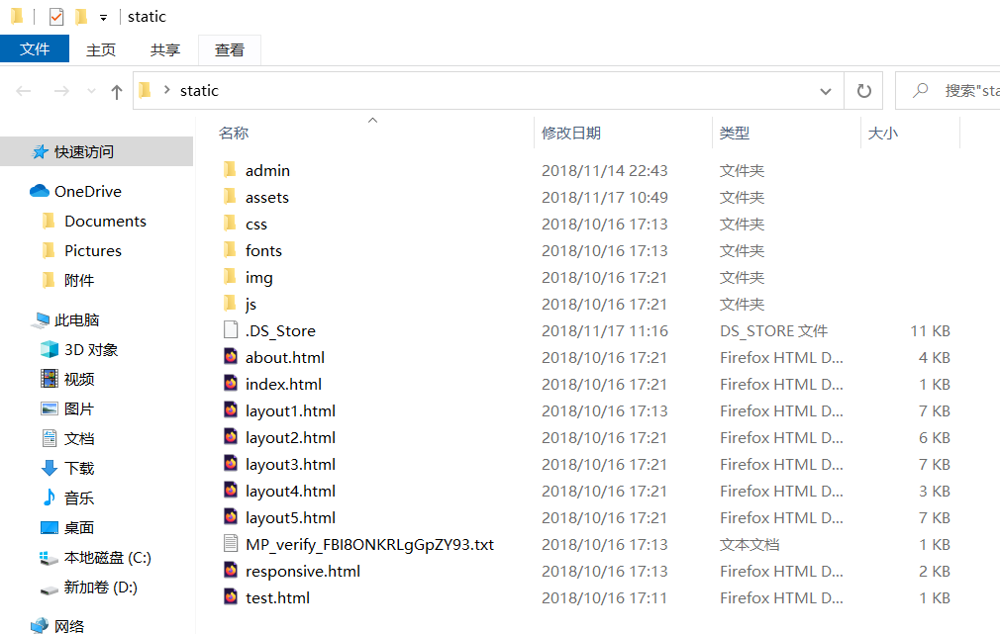

##### getotp.html

新建一个getotp.html作为获取otp短信界面

```html
<html>
<head>
<meta charset="UTF-8">
<script src = "static/assets/global/plugins/jquery-1.11.0.min.js" type="text/javascript"></script>
</head>

<body>
	<div>
		<h3>获取otp信息</h3>
		
		<div>
			<label>手机号</label>
			<div>
				<input type="text" placeholder="手机号" name="telphone" id="telphone"/>
			</div>
		</div>
		
		<div>
			<button id= "getotp" type="submit">
			获取otp短信
			</button>
		</div>
	</div>
</body>


<script>
    jQuery(document).ready(function () {
        $("#getotp").on("click",function () {
            var telphone = $("#telphone").val();
            if (telphone == null || telphone === "") {
                alert("手机号不能为空");
                return false;
            }
            $.ajax({
                type:"POST",
                contentType:"application/x-www-form-urlencoded",
                url:"http://localhost:8080/user/getotp",
                data:{
                    "telphone":telphone,
                },
                success:function (data) {
                    if (data.status === "success") {
                        alert("短信发送成功，请查收");
                    }else {
                        alert("短信发送失败，原因是"+data.data.errMsg);
                    }
                },
                error:function (data) {
                    alert("短信发送失败"+data.responseText);
                }
            })
        });
    });

</script>
</html>
```

这里ajax的type、contentType都对应下面的设置

在UserController的getOtp上增加method = {RequestMethod.POST}，让getotp方法必须映射到http的POST请求才处理，comsumes对应后端需要消费的Content Type的名字，指明为传统的HTTP的url form encoded方式"application/x-www-form-urlencoded"

```java
//用户获取otp短信接口
@RequestMapping(value = "/getotp",method = {RequestMethod.POST},consumes = {CONTENT_TYPE_FORMED})
@ResponseBody
public CommonReturnType getOtp(@RequestParam(name="telphone") String telphone) {
    //需要按照一定规则生成OTP验证码
    Random random = new Random();
    int randomInt = random.nextInt(99999);
    randomInt += 10000;
    String otpCode = String.valueOf(randomInt);

    //将OTP验证码同对应用户的手机号关联，使用httpsession的方式绑定他的手机号与OTPCODE
    httpServletRequest.getSession().setAttribute(telphone,otpCode);

    //将OTP验证码通过短信通道发送给用户，这里省略
    System.out.println("telphone=" + telphone + "otpCode=" + otpCode);
    return CommonReturnType.create(null);
}
```

这里将它抽象出来在baseController中定义CONTENT_TYPE_FORMED

```java
public class BaseController {
    public static final String CONTENT_TYPE_FORMED = "application/x-www-form-urlencoded";
```

##### 遇到的问题

启动项目测试，输入手机号发现报错Access to XMLHttpRequest at 'http://localhost:8080/user/getotp' from origin 'null' has been blocked by CORS policy: No 'Access-Control-Allow-Origin' header is present on the requested resource.

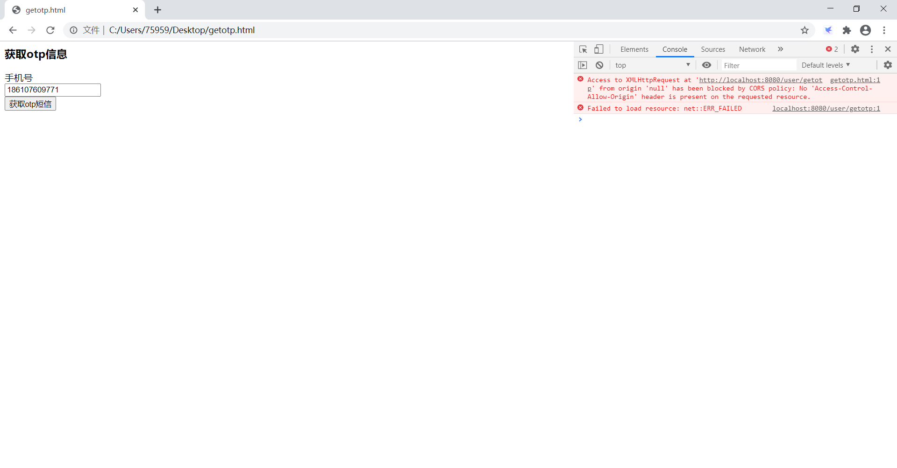

这是一个跨域请求错误，ajax启动于getotp.html，对应的域是本地文件。请求的服务器是localhost域名，虽然请求能够到达服务端并返回，但是ajax请求回调认定这种跨域回调是不安全的，因此会报错，并且走不到ajax的success block里面

**解决方法**：在Spring Boot里有专门解决办法，那就是让reponse时刻返回Access-Control-Allow-Origin这个header为所有的域，也就是*号即可

Spring Boot有专门的注解：**@CrossOrigin**

```java
//用户获取otp短信接口
@RequestMapping(value = "/getotp",method = {RequestMethod.POST},consumes = {CONTENT_TYPE_FORMED})
@ResponseBody
@CrossOrigin
public CommonReturnType getOtp(@RequestParam(name="telphone") String telphone) {
    //需要按照一定规则生成OTP验证码
    Random random = new Random();
    int randomInt = random.nextInt(99999);
    randomInt += 10000;
    String otpCode = String.valueOf(randomInt);

    //将OTP验证码同对应用户的手机号关联，使用httpsession的方式绑定他的手机号与OTPCODE
    httpServletRequest.getSession().setAttribute(telphone,otpCode);

    //将OTP验证码通过短信通道发送给用户，这里省略
    System.out.println("telphone=" + telphone + "otpCode=" + otpCode);
    return CommonReturnType.create(null);
}
```

通过这个注解，可以完成Spring Boot对应返回对应Web请求当中加上跨域Allow Header

再次测试，可以发现，返回的Response Header里Access-Control-Allow-Origin=*，代表允许所有的域

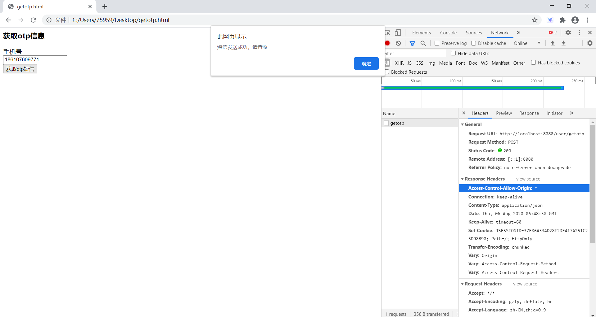

##### getotp界面美化

添加BootStrap的样式

```html
<html>
<head>
<meta charset="UTF-8">

<link href="static/assets/global/plugins/bootstrap/css/bootstrap.min.css" rel="stylesheet" type="text/css">
<link href="static/assets/global/css/components.css" rel="stylesheet" type="text/css">
<link href="static/assets/admin/pages/css/login.css" rel="stylesheet" type="text/css">
<script src = "static/assets/global/plugins/jquery-1.11.0.min.js" type="text/javascript"></script>
</head>

<body class="login">
	<div class="content">
		<h3 class=>获取otp信息</h3>
		
		<div class="form-group">
			<label class="control-label">手机号</label>
			<div>
				<input class="form-control" type="text" placeholder="手机号" name="telphone" id="telphone"/>
			</div>
		</div>
		
		<div class="from-actions">
			<button class="btn blue" id= "getotp" type="submit">
			获取otp短信
			</button>
		</div>
	</div>
</body>


<script>
    jQuery(document).ready(function () {
        $("#getotp").on("click",function () {
            var telphone = $("#telphone").val();
            if (telphone == null || telphone === "") {
                alert("手机号不能为空");
                return false;
            }
            $.ajax({
                type:"POST",
                contentType:"application/x-www-form-urlencoded",
                url:"http://localhost:8080/user/getotp",
                data:{
                    "telphone":telphone,
                },
                success:function (data) {
                    if (data.status === "success") {
                        alert("短信发送成功，请查收");
                    }else {
                        alert("短信发送失败，原因是"+data.data.errMsg);
                    }
                },
                error:function (data) {
                    alert("短信发送失败"+data.responseText);
                }
            })
        });
    });

</script>
</html>
```

#### 用户手机登录