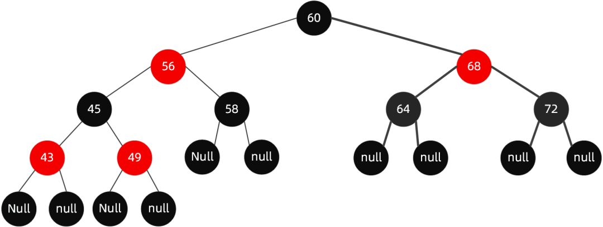

二叉平衡树：左右子树高度之差不超过1

#### 什么是红黑树

红黑树是一个二叉平衡树，二叉树的平均查找时间是O(logn)，但二叉平衡树不会自我平衡，如果不巧可能会成为一条线，退化成链表。所以红黑树通过旋转等的操作，保证自己是平衡的。

#### 红黑树原则

1.构成树的结点拥有一个颜色属性，要么是黑要么是红

2.根节点必须是黑色的，叶子节点必须是黑色的

3.从叶节点到根节点的路径上，每条路径黑色节点的数目是一致的

4.不能有两个红色节点相连

每次新插入的节点是红色，按照自己是左子树还是右子树、父节点和和叔叔节点的颜色等条件进行左旋和右旋