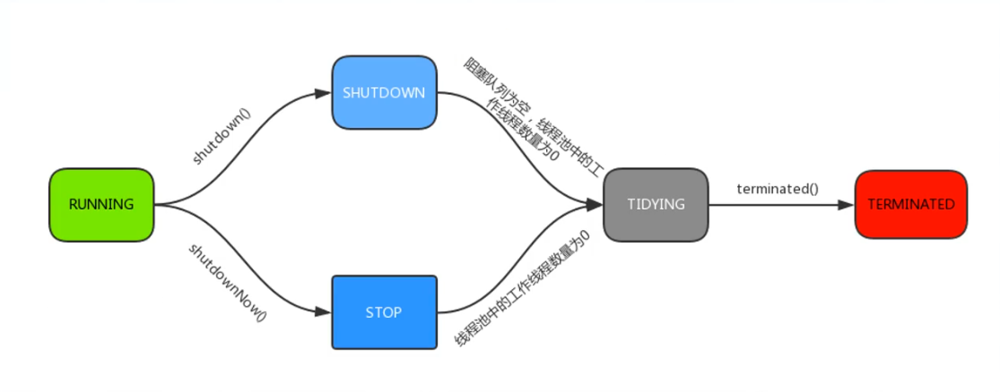
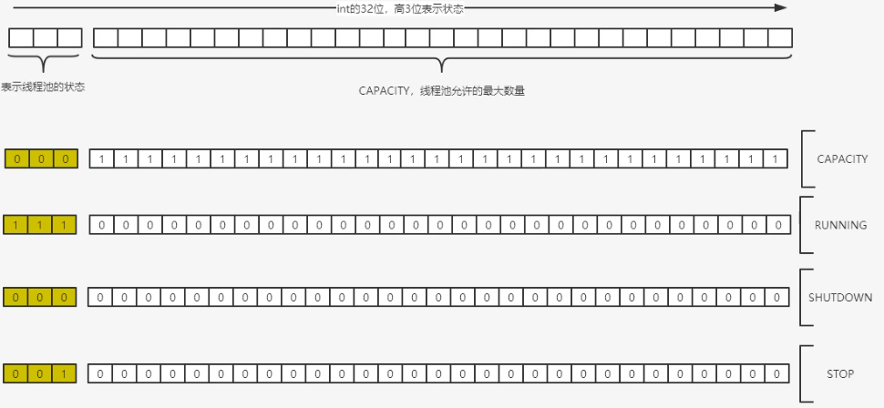
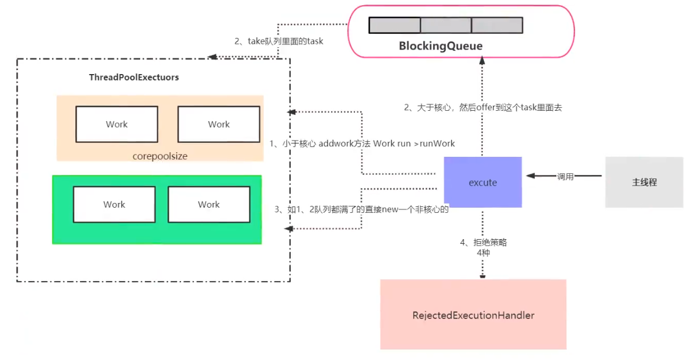
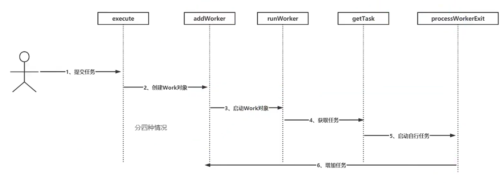

## ThreadPollExecutor

### 线程池的类型

#### Executors.newFixedThreadPool()

```java
public static ExecutorService newFixedThreadPool(int nThreads) {
    return new ThreadPoolExecutor(nThreads, nThreads,
                                  0L, TimeUnit.MILLISECONDS,
                                  new LinkedBlockingQueue<Runnable>());
}
```

传入核心线程数，最大线程数为核心线程数，核心线程空闲到时间不会回收，队列是LinkedBlokingQueue是无界队列，等待的线程可以是Integer.MAX_VALUE，可能会造成OOM

特点：只有这些核心线程服务，不会创建多余的非核心线程，适合控制最大并发数的场景

#### Executors.newSingleThreadExecutor()

```java
public static ExecutorService newSingleThreadExecutor() {
    return new FinalizableDelegatedExecutorService
        (new ThreadPoolExecutor(1, 1,
                                0L, TimeUnit.MILLISECONDS,
                                new LinkedBlockingQueue<Runnable>()));
}
```

核心线程数是1，最大线程数是核心线程数，核心线程空闲到时间不会回收，队列是LinkedBlokingQueue是无界队列，等待的线程可以是Integer.MAX_VALUE，可能会造成OOM

特点：保证所有任务按照指定FIFO顺序在一个线程中执行

#### Executors.newCachedThreadPool()

```java
public static ExecutorService newCachedThreadPool() {
    return new ThreadPoolExecutor(0, Integer.MAX_VALUE,
                                  60L, TimeUnit.SECONDS,
                                  new SynchronousQueue<Runnable>());
}
```

核心线程数是0，最大线程数是Integer.MAX_VALUE，可以创建的线程数是Integer.MAX_VALUE，可能会造成OOM，线程的存活时间是60s，队列是SynchronousQueue是不存储元素的阻塞队列

特点：任何线程任务到来都可以立即执行，不需要等待。线程可以无限创建，有60s的空闲后存活时间。适合执行大量、耗时少的线程任务

#### Executors.newScheduledThreadPool()

```java
public static ScheduledExecutorService newScheduledThreadPool(int corePoolSize) {
    return new ScheduledThreadPoolExecutor(corePoolSize);
}

public ScheduledThreadPoolExecutor(int corePoolSize) {
    super(corePoolSize, Integer.MAX_VALUE, 0, NANOSECONDS,
          new DelayedWorkQueue());
}
```

传入核心线程数，最大线程数是Integer.MAX_VALUE，存活时间是0纳秒，也就是空闲立即回收

特点：执行定时/周期性任务

### 线程池参数

```java
public ThreadPoolExecutor(int corePoolSize,
                          int maximumPoolSize,
                          long keepAliveTime,
                          TimeUnit unit,
                          BlockingQueue<Runnable> workQueue) {
    this(corePoolSize, maximumPoolSize, keepAliveTime, unit, workQueue,
         Executors.defaultThreadFactory(), defaultHandler);
}
```

从ThreadPollExecutor的构造函数可以看见参数有，corePoolSize核心线程数、maximumPoolSize最大线程数、keepAliveTime存活时间、unit时间单位、workQueue等待队列、ThreadFactory线程工厂、Handler饱和策略

<!--more-->

#### Handler饱和策略

当线程池的任务队列已满并且线程数目达到maximumPoolSize时，对于新加的任务一般会采取拒绝策略，通常有以下四种策略：

1. AbortPolicy：直接抛出异常，这是默认策略；
2. CallerRunsPolicy：被拒绝的任务在主线程中运行，让主线程直接调用run方法，而不是开启其他线程。所以主线程就被阻塞了，别的任务只能在被拒绝的任务执行完之后才会继续被提交到线程池执行，此时主线程不接受任何任务过来执行；
3. DiscardOldestPolicy：丢弃阻塞队列中最早的任务，并执行当前任务；
4. DiscardPolicy：直接丢弃任务；

### 线程池状态

Running：能接收新任务，以及处理已经添加的任务

Shutdown：不接收新任务，可以处理已经添加的任务

Stop：不接受新任务，不处理已经添加的任务，中断正在处理的任务

Tidying：所有任务已经停止，ctl记录的任务数量为0

Terminated：线程池彻底关闭



```java
executor.shutdown();//Running状态转Shutdown状态，等待正在运行的线程和等待队列里的线程都运行完毕
executor.shutdownNow();//Running状态转Stop状态，立马对正在执行的线程执行中断(Interupt方法)，让线程找到一个安全的点中断，等待队列的线程不再执行
```


线程池的状态采用了一个AtomicInteger ctl记录了当前线程池的状态和当前线程池工作线程数量，将两个数据都记录在一个AtomicInteger里提高了效率也保证了不同线程读的时候的线程安全问题

```java
private final AtomicInteger ctl = new AtomicInteger(ctlOf(RUNNING, 0));
private static final int COUNT_BITS = Integer.SIZE - 3;//32 - 3 = 29
private static final int CAPACITY   = (1 << COUNT_BITS) - 1;

// runState is stored in the high-order bits
private static final int RUNNING    = -1 << COUNT_BITS;
//-1的补码:1111 1111 1111 1111 1111 1111 1111 1111
//左移29位:1110 0000 0000 0000 0000 0000 0000 0000
//高3位位111代表Running状态
private static final int SHUTDOWN   =  0 << COUNT_BITS;
private static final int STOP       =  1 << COUNT_BITS;
private static final int TIDYING    =  2 << COUNT_BITS;
private static final int TERMINATED =  3 << COUNT_BITS;
```



用高3位记录线程池生命状态，用剩下29为记录当前工作线程数量

图里的CAPACITY是指29位的工作线程数量可能的最大数量

### execute源码

```java
public void execute(Runnable command) {
    if (command == null)
        throw new NullPointerException();
    //获取ctl的值，前面说了，该值记录着runState和workerCount
    int c = ctl.get();
    /*
     * 调用workerCountOf得到当前活动的线程数；
     * 当前活动线程数小于corePoolSize，新建一个线程放入线程池中；
     * addWorker(): 把任务添加到该线程中。
     */
    if (workerCountOf(c) < corePoolSize) {
        if (addWorker(command, true))
            return;
        //如果上面的添加线程操作失败，重新获取ctl值
        c = ctl.get();
    }
    //如果当前线程池是运行状态，并且往工作队列中添加该任务
    if (isRunning(c) && workQueue.offer(command)) {
        int recheck = ctl.get();
        /*
         * 如果当前线程不是运行状态，把任务从队列中移除
         * 调用reject(内部调用handler)拒绝接受任务	
         */
        if (! isRunning(recheck) && remove(command))
            reject(command);
        //获取线程池中的有效线程数，如果为0，则执行addWorker创建一个新线程
        else if (workerCountOf(recheck) == 0)
            addWorker(null, false);
    }
    /*
     * 如果执行到这里，有两种情况：
     * 1. 线程池已经不是RUNNING状态；
     * 2. 线程池是RUNNING状态，但workerCount >= corePoolSize并且workQueue已满。
     * 这时，再次调用addWorker方法，但第二个参数传入为false，将线程池的有限线程数量的上限设置为maximumPoolSize；
     * 如果失败则拒绝该任务
     */
    else if (!addWorker(command, false))
        reject(command);
}
```



1. 线程池中的数量小于corePoolSize，即使线程池中的线程都处于空闲状态，也要创建新的线程来处理被添加的任务
2. 线程池中的数量等于corePoolSize，但是缓冲队列workQueue未满，那么任务被放入队列
3. 缓冲队列workQueue满，并且线程池中的数量小于maximumPoolSize，建新的线程来处理被添加的任务
4. 缓冲队列workQueue满，并且线程池中的数量等于maximumPoolSize，通过 handler饱和策略来处理此任务
5. 线程池中的线程数量大于 corePoolSize时，如果某线程空闲时间超过keepAliveTime，线程将被终止

### addWorker源码

```java
    private boolean addWorker(Runnable firstTask, boolean core) {
        retry:
        for (;;) {
            int c = ctl.get();
            int rs = runStateOf(c);

            // Check if queue empty only if necessary.
            if (rs >= SHUTDOWN &&
                ! (rs == SHUTDOWN &&
                   firstTask == null &&
                   ! workQueue.isEmpty()))
                return false;

            for (;;) {
                int wc = workerCountOf(c);
                if (wc >= CAPACITY ||
                    wc >= (core ? corePoolSize : maximumPoolSize))
                    return false;
                if (compareAndIncrementWorkerCount(c))
                    break retry;
                c = ctl.get();  // Re-read ctl
                if (runStateOf(c) != rs)
                    continue retry;
                // else CAS failed due to workerCount change; retry inner loop
            }
        }

        boolean workerStarted = false;
        boolean workerAdded = false;
        Worker w = null;
        try {
            w = new Worker(firstTask);
            final Thread t = w.thread;
            if (t != null) {
                final ReentrantLock mainLock = this.mainLock;
                mainLock.lock();
                try {
                    // Recheck while holding lock.
                    // Back out on ThreadFactory failure or if
                    // shut down before lock acquired.
                    int rs = runStateOf(ctl.get());

                    if (rs < SHUTDOWN ||
                        (rs == SHUTDOWN && firstTask == null)) {
                        if (t.isAlive()) // precheck that t is startable
                            throw new IllegalThreadStateException();
                        workers.add(w);
                        int s = workers.size();
                        if (s > largestPoolSize)
                            largestPoolSize = s;
                        workerAdded = true;
                    }
                } finally {
                    mainLock.unlock();
                }
                if (workerAdded) {
                    t.start();
                    workerStarted = true;
                }
            }
        } finally {
            if (! workerStarted)
                addWorkerFailed(w);
        }
        return workerStarted;
    }
```

addWorker：在线程池中创建一个新的Worker并执行，其中firstTask参数指定的是新线程需要执行的第一个任务，core参数决定于活动线程数的比较对象是corePoolSize还是maximumPoolSize。根据传进来的参数首先对线程池和队列的状态进行判断，满足条件就新建一个Worker对象。

### Worker类

```java
private final class Worker
    extends AbstractQueuedSynchronizer
    implements Runnable
{
    /**
     * This class will never be serialized, but we provide a
     * serialVersionUID to suppress a javac warning.
     */
    private static final long serialVersionUID = 6138294804551838833L;

    /** Thread this worker is running in.  Null if factory fails. */
    final Thread thread;
    /** Initial task to run.  Possibly null. */
    Runnable firstTask;
    
    /** Delegates main run loop to outer runWorker  */
    public void run() {
        runWorker(this);
    }
```

Work对象有两个字段，一个是thread表示现在是哪个线程，二是firstTask表示第一个要执行的任务。

因为Worker实现了Runnable接口，所以当Worker类中的线程启动时，调用的其实是run()方法。run方法中调用的是`runWorker`方法

### runWorker方法

```java
    final void runWorker(Worker w) {
        Thread wt = Thread.currentThread();
        Runnable task = w.firstTask;
        w.firstTask = null;
        w.unlock(); // allow interrupts
        boolean completedAbruptly = true;
        try {
            while (task != null || (task = getTask()) != null) {
                w.lock();
                // If pool is stopping, ensure thread is interrupted;
                // if not, ensure thread is not interrupted.  This
                // requires a recheck in second case to deal with
                // shutdownNow race while clearing interrupt
                if ((runStateAtLeast(ctl.get(), STOP) ||
                     (Thread.interrupted() &&
                      runStateAtLeast(ctl.get(), STOP))) &&
                    !wt.isInterrupted())
                    wt.interrupt();
                try {
                    beforeExecute(wt, task);
                    Throwable thrown = null;
                    try {
                        task.run();
                    } catch (RuntimeException x) {
                        thrown = x; throw x;
                    } catch (Error x) {
                        thrown = x; throw x;
                    } catch (Throwable x) {
                        thrown = x; throw new Error(x);
                    } finally {
                        afterExecute(task, thrown);
                    }
                } finally {
                    task = null;
                    w.completedTasks++;
                    w.unlock();
                }
            }
            completedAbruptly = false;
        } finally {
            processWorkerExit(w, completedAbruptly);
        }
    }
```

总结一下runWorker方法的运行逻辑：

1、通过while循环不断地通过getTask()方法从队列中获取任务，如果有firstTask就不用从队列获取；

2、调用task的run()方法执行任务，执行完毕后需要置为null；

3、循环调用getTask()取不到任务了，跳出循环，执行processWorkerExit()方法。

### processWorkerExit方法

```java
    private void processWorkerExit(Worker w, boolean completedAbruptly) {
        if (completedAbruptly) // If abrupt, then workerCount wasn't adjusted
            decrementWorkerCount();

        final ReentrantLock mainLock = this.mainLock;
        mainLock.lock();
        try {
            completedTaskCount += w.completedTasks;
            workers.remove(w);
        } finally {
            mainLock.unlock();
        }

        tryTerminate();

        int c = ctl.get();
        if (runStateLessThan(c, STOP)) {
            if (!completedAbruptly) {
                int min = allowCoreThreadTimeOut ? 0 : corePoolSize;
                if (min == 0 && ! workQueue.isEmpty())
                    min = 1;
                if (workerCountOf(c) >= min)
                    return; // replacement not needed
            }
            addWorker(null, false);
        }
    }
```

processWorkerExit方法的作用主要是对worker对象的移除，如果当前运行的Worker数比当前所需要的Worker数少的话，那么就会调用addWorker，添加新的Worker，也就是新开启线程继续处理任务。

### 线程池的复用机制



线程池的底层核心是Worker类

当通过execute提交了一个任务后，会在execute中判断四种情况，如果线程数小于核心线程数，或者队列满了但仍小于最大线程数，这个时候需要addWorker()。如果一开始提交了任务放到了队列里，就等着别的Worker来拿我的任务去执行

addWorker会创建一个Worker对象，Worker对象有两个参数，一个是FirstTask表示第一个要执行的任务，二是Thread表示当前线程，Worker对象实现了Runnable接口，当在addWorker中启动Worker内的关联线程（Worker.thread.start()）时，会调用Worker里的run方法

Worker的run方法会调用runWorker方法，

runWorker方法会循环执行task，先判断firstTask为不为空，不为空执行firstTask，为空task从队列里拿

拿不到task执行processWorkerExit，清除掉该Worker，判断如果当前运行的Worker数比当前所需要的Worker数少的话，那么就会调用addWorker(null,false)，添加新的Worker，也就是新开启线程继续处理任务